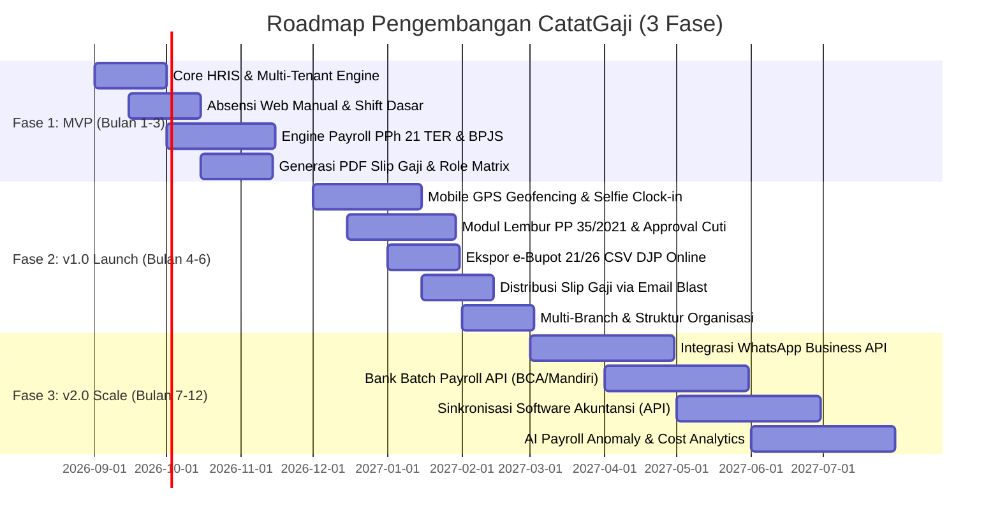

# Dokumen Analisis Arsitektur Teknis, Data Model, Spesifikasi API, dan Kepatuhan Regulasi CatatGaji

**Dokumen**: Technical Architecture & API Specification Mining Survey  
**Aplikasi**: CatatGaji (Multi-Tenant SaaS Payroll & HRIS untuk Bisnis Indonesia)  
**Versi**: 1.0.0  
**Tanggal**: 17 Agustus 2026  
**Status**: Authoritative Technical Architecture Baseline  
**Penyusun**: Technical Architecture & API Spec Miner Agent  

---

## Daftar Isi
1. [Ringkasan Eksekutif & Prinsip Desain Sistem](#1-ringkasan-eksekutif--prinsip-desain-sistem)
2. [Arsitektur Data Model & Database (ERD Multi-Tenant)](#2-arsitektur-data-model--database-erd-multi-tenant)
   - 2.1 [Strategi Multi-Tenancy & Row-Level Security (RLS)](#21-strategi-multi-tenancy--row-level-security-rls)
   - 2.2 [Diagram Entity Relationship (ERD)](#22-diagram-entity-relationship-erd)
   - 2.3 [Spesifikasi Skema & Kamus Data 16 Tabel](#23-spesifikasi-skema--kamus-data-16-tabel)
   - 2.4 [Strategi Indeks, Partisi, dan Kinerja Database](#24-strategi-indeks-partisi-dan-kinerja-database)
3. [Spesifikasi Antarmuka Pemrograman Aplikasi (REST API Specs)](#3-spesifikasi-antarmuka-pemrograman-aplikasi-rest-api-specs)
   - 3.1 [Standar Protokol, Konvensi, dan Error Handling](#31-standar-protokol-konvensi-dan-error-handling)
   - 3.2 [Daftar Lengkap 24 REST Endpoints Terinci](#32-daftar-lengkap-24-rest-endpoints-terinci)
4. [Rekomendasi Platform & Evaluasi Tech Stack](#4-rekomendasi-platform--evaluasi-tech-stack)
   - 4.1 [Analisis Trade-Off Frontend Web & Desktop](#41-analisis-trade-off-frontend-web--desktop)
   - 4.2 [Analisis Trade-Off Mobile Application](#42-analisis-trade-off-mobile-application)
   - 4.3 [Evaluasi Backend Engine & Database](#43-evaluasi-backend-engine--database)
   - 4.4 [Evaluasi Cloud Provider & Kedaulatan Data Indonesia](#44-evaluasi-cloud-provider--kedaulatan-data-indonesia)
   - 4.5 [Arsitektur Topologi Infrastruktur Target](#45-arsitektur-topologi-infrastruktur-target)
5. [Non-Functional Requirements (NFR) & Kepatuhan UU PDP No. 27/2022](#5-non-functional-requirements-nfr--kepatuhan-uu-pdp-no-272022)
   - 5.1 [Arsitektur Kepatuhan UU No. 27 Tahun 2022 (UU PDP)](#51-arsitektur-kepatuhan-uu-no-27-tahun-2022-uu-pdp)
   - 5.2 [Kinerja, SLA, dan Skalabilitas Sistem](#52-kinerja-sla-dan-skalabilitas-sistem)
   - 5.3 [Audit Trail, Integritas Data, dan Disaster Recovery (DR)](#53-audit-trail-integritas-data-dan-disaster-recovery-dr)
6. [Roadmap Pengembangan Produk (3 Fase Deliverables)](#6-roadmap-pengembangan-produk-3-fase-deliverables)
   - 6.1 [Fase 1: MVP (Bulan 1–3) — Core HRIS & Engine Payroll Dasar](#61-fase-1-mvp-bulan-13--core-hris--engine-payroll-dasar)
   - 6.2 [Fase 2: v1.0 Production Launch (Bulan 4–6) — Mobile GPS, Cuti, Lembur, & e-Bupot](#62-fase-2-v10-production-launch-bulan-46--mobile-gps-cuti-lembur--e-bupot)
   - 6.3 [Fase 3: v2.0 Scale & Integration (Bulan 7–12) — WhatsApp, Bank Batch Disburse, & AI](#63-fase-3-v20-scale--integration-bulan-712--whatsapp-bank-batch-disburse--ai)

---

## 1. Ringkasan Eksekutif & Prinsip Desain Sistem

Aplikasi **CatatGaji** dirancang sebagai solusi *Multi-Tenant Software as a Service (SaaS)* untuk menjawab kompleksitas regulasi ketenagakerjaan dan perpajakan di Indonesia bagi usaha kecil dan menengah (UKM / SME) serta korporasi berkembang.

### Prinsip Arsitektural Utama:
1. **Regulasi-Kepatuhan Pertama (Compliance-First by Design)**:
   - Kalkulasi PPh 21 mengadopsi penuh **Tarif Efektif Rata-rata (TER)** sesuai **PP No. 58/2023** dan **PMK No. 168/2023** (Kategori A, B, C untuk masa pajak bulanan Jan–Nov dan rekonsiliasi Pasal 17 ayat 1 huruf a pada masa pajak Des).
   - Perhitungan BPJS Ketenagakerjaan mencakup 4 program: Jaminan Kecelakaan Kerja (JKK 5 kelas risiko: 0,24% s.d. 1,74%), Jaminan Kematian (JKM: 0,30%), Jaminan Hari Tua (JHT: 3,7% pemberi kerja, 2% pekerja), dan Jaminan Pensiun (JP: 2% pemberi kerja, 1% pekerja dengan batas upah maksimal / cap tahunan).
   - BPJS Kesehatan (4% pemberi kerja, 1% pekerja dengan batas upah maksimal Rp 12.000.000,-).
   - Upah lembur sesuai **PP No. 35/2021** (1,5x upah sejam untuk jam pertama, 2x upah sejam untuk jam berikutnya pada hari kerja; 2x, 3x, 4x pada hari istirahat/libur resmi).
2. **Isolasi Tenant Ketat (Zero Data Leakage Across Tenants)**:
   - Pola *Shared Database, Shared Schema* yang diperkuat dengan PostgreSQL **Row-Level Security (RLS)** native. Setiap kueri database secara deterministik terikat pada `tenant_id` sesi saat ini.
3. **Kedaulatan Data & Kepatuhan UU PDP No. 27/2022**:
   - Seluruh data pemrosesan pribadi (NIK, NPWP, nomor rekening bank, data biometrik/selfie absensi, slip gaji) dienkripsi dengan standar **AES-256-GCM** pada level database/storage (*at-rest*) dan **TLS 1.3** (*in-transit*), dengan pusat data wajib berlokasi di wilayah Republik Indonesia (PP No. 71/2019 & UU PDP).
4. **Performa Tinggi & Determinisme Finansial**:
   - Engine payroll menggunakan arsitektur *event-driven worker pool* asinkron untuk kalkulasi batch (kapasitas 500 karyawan diproses dalam waktu < 3 detik).
   - Seluruh hasil kalkulasi disimpan dalam format snapshot permanen (`calculation_snapshot_json`), memastikan angka historis tidak pernah berubah meski konfigurasi gaji atau regulasi pajak diperbarui di masa mendatang.

---

## 2. Arsitektur Data Model & Database (ERD Multi-Tenant)

### 2.1 Strategi Multi-Tenancy & Row-Level Security (RLS)

CatatGaji menggunakan model arsitektur **Shared Database, Shared Schema with Row-Level Security (RLS)** pada PostgreSQL 16+. Pendekatan ini memberikan efisiensi biaya operasional (*cost-effective compute & memory*), kemudahan migrasi skema terpusat, serta jaminan keamanan isolasi data sekelas *isolated database*.

#### Mekanisme Kerja RLS:
1. Setiap tabel yang menyimpan data spesifik organisasi memiliki kolom `tenant_id UUID NOT NULL REFERENCES tenants(id) ON DELETE CASCADE`.
2. Koneksi aplikasi (*database pooler*) mengeksekusi perintah session parameter sebelum menjalankan kueri:
   ```sql
   SET LOCAL app.current_tenant_id = '018dc3f2-89ab-7000-8000-000000000001';
   ```
3. PostgreSQL mengevaluasi fungsi helper RLS:
   ```sql
   CREATE OR REPLACE FUNCTION current_tenant_id() RETURNS UUID AS $$
   BEGIN
       RETURN NULLIF(current_setting('app.current_tenant_id', true), '')::UUID;
   END;
   $$ LANGUAGE plpgsql STABLE;
   ```
4. Setiap tabel diproteksi dengan kebijakan:
   ```sql
   ALTER TABLE employees ENABLE ROW LEVEL SECURITY;
   ALTER TABLE employees FORCE ROW LEVEL SECURITY;

   CREATE POLICY tenant_isolation_policy ON employees
       FOR ALL
       USING (tenant_id = current_tenant_id())
       WITH CHECK (tenant_id = current_tenant_id());
   ```
5. Untuk kueri background job / worker internal lintas tenant, digunakan database role khusus berizin `BYPASSRLS` yang hanya dapat diakses melalui internal microservices terenkripsi.

---

### 2.2 Diagram Entity Relationship (ERD)

```mermaid
erDiagram
    tenants ||--o{ users : "has"
    tenants ||--o{ roles_permissions : "defines"
    tenants ||--o{ branches_departments : "contains"
    tenants ||--o{ employees : "employs"
    tenants ||--o{ shifts_schedules : "configures"
    tenants ||--o{ leave_types : "configures"
    tenants ||--o{ payroll_periods : "executes"
    tenants ||--o{ tax_reports_e_bupot : "files"
    tenants ||--o{ audit_logs : "records"

    users ||--o| employees : "linked_to"
    roles_permissions ||--o{ users : "assigned_to"
    branches_departments ||--o{ employees : "assigned_branch"
    branches_departments ||--o{ employees : "assigned_dept"

    employees ||--o{ employee_salaries : "has_salary_history"
    employees ||--o{ attendances : "clocks"
    employees ||--o{ leave_requests : "submits_leave"
    employees ||--o{ overtime_requests : "submits_overtime"
    employees ||--o{ payroll_items : "receives_payroll"

    shifts_schedules ||--o{ attendances : "scheduled_for"
    leave_types ||--o{ leave_requests : "categorizes"

    payroll_periods ||--o{ payroll_items : "contains"
    payroll_items ||--|| payslips : "generates"

    tenants {
        uuid id PK
        varchar name
        varchar slug UK
        varchar tier
        varchar status
        jsonb settings_json
        timestamptz created_at
        timestamptz updated_at
    }

    users {
        uuid id PK
        uuid tenant_id FK
        varchar email
        varchar password_hash
        varchar role
        uuid employee_id FK
        boolean is_active
        timestamptz last_login_at
        timestamptz created_at
        timestamptz updated_at
    }

    roles_permissions {
        uuid id PK
        uuid tenant_id FK
        varchar role_name
        text[] permissions_array
        text description
        timestamptz created_at
        timestamptz updated_at
    }

    branches_departments {
        uuid id PK
        uuid tenant_id FK
        varchar name
        varchar type
        varchar code
        uuid parent_id FK
        text address
        numeric latitude
        numeric longitude
        integer radius_meters
        timestamptz created_at
        timestamptz updated_at
    }

    employees {
        uuid id PK
        uuid tenant_id FK
        varchar nik_ktp
        varchar npwp
        varchar bpjs_kes_no
        varchar bpjs_tk_no
        varchar full_name
        varchar email
        varchar phone
        uuid branch_id FK
        uuid department_id FK
        date join_date
        date resign_date
        varchar employment_status
        varchar ptkp_status
        varchar salary_type
        varchar bank_name
        varchar bank_account_no
        varchar bank_account_holder
        varchar status
        timestamptz created_at
        timestamptz updated_at
    }

    employee_salaries {
        uuid id PK
        uuid tenant_id FK
        uuid employee_id FK
        numeric basic_salary
        jsonb fixed_allowances_json
        jsonb non_fixed_allowances_json
        smallint jkk_risk_grade
        boolean bpjs_kes_override
        varchar pph21_scheme
        date effective_date
        boolean is_current
        timestamptz created_at
        timestamptz updated_at
    }

    shifts_schedules {
        uuid id PK
        uuid tenant_id FK
        varchar name
        varchar code
        time start_time
        time end_time
        time break_start
        time break_end
        smallint break_duration_minutes
        smallint[] work_days
        smallint grace_period_minutes
        timestamptz created_at
        timestamptz updated_at
    }

    attendances {
        uuid id PK
        uuid tenant_id FK
        uuid employee_id FK
        uuid shift_id FK
        date date
        time check_in_time
        time check_out_time
        smallint late_minutes
        smallint early_leave_minutes
        numeric work_hours
        varchar status
        numeric check_in_latitude
        numeric check_in_longitude
        numeric check_out_latitude
        numeric check_out_longitude
        text selfie_url
        text notes
        boolean is_overtime_applied
        timestamptz created_at
        timestamptz updated_at
    }

    leave_types {
        uuid id PK
        uuid tenant_id FK
        varchar name
        varchar code
        smallint default_quota
        boolean is_paid
        varchar gender_restriction
        boolean requires_attachment
        smallint max_consecutive_days
        timestamptz created_at
        timestamptz updated_at
    }

    leave_requests {
        uuid id PK
        uuid tenant_id FK
        uuid employee_id FK
        uuid leave_type_id FK
        date start_date
        date end_date
        numeric total_days
        text reason
        text attachment_url
        varchar status
        uuid approved_by FK
        timestamptz approved_at
        text rejection_reason
        timestamptz created_at
        timestamptz updated_at
    }

    overtime_requests {
        uuid id PK
        uuid tenant_id FK
        uuid employee_id FK
        date date
        time start_time
        time end_time
        numeric total_hours
        jsonb rate_multiplier_breakdown_json
        text task_description
        varchar spkl_no
        varchar status
        uuid approved_by FK
        timestamptz approved_at
        text rejection_reason
        timestamptz created_at
        timestamptz updated_at
    }

    payroll_periods {
        uuid id PK
        uuid tenant_id FK
        varchar name
        smallint month
        integer year
        date start_date
        date end_date
        date payment_date
        date cutoff_date
        varchar status
        numeric total_gross
        numeric total_net
        numeric total_tax
        numeric total_bpjs_company
        numeric total_bpjs_employee
        integer total_employees
        uuid approved_by FK
        timestamptz approved_at
        timestamptz created_at
        timestamptz updated_at
    }

    payroll_items {
        uuid id PK
        uuid tenant_id FK
        uuid payroll_period_id FK
        uuid employee_id FK
        numeric basic_salary
        numeric fixed_allowance
        numeric non_fixed_allowance
        numeric overtime_pay
        numeric bonus_thr
        numeric reimbursement
        numeric jkk_company
        numeric jkm_company
        numeric jht_company
        numeric jp_company
        numeric bpjs_kes_company
        numeric gross_income
        numeric jht_employee
        numeric jp_employee
        numeric bpjs_kes_employee
        varchar pph21_ter_category
        numeric pph21_ter_rate
        numeric pph21_amount
        numeric deductions_other
        numeric take_home_pay
        jsonb calculation_snapshot_json
        timestamptz created_at
        timestamptz updated_at
    }

    payslips {
        uuid id PK
        uuid tenant_id FK
        uuid payroll_item_id FK
        varchar slip_number
        varchar access_pin_hash
        text pdf_url
        text encrypted_pdf_key
        timestamptz sent_email_at
        timestamptz sent_wa_at
        timestamptz downloaded_at
        timestamptz created_at
        timestamptz updated_at
    }

    tax_reports_e_bupot {
        uuid id PK
        uuid tenant_id FK
        smallint tax_period_month
        integer tax_period_year
        integer total_taxpayers
        numeric total_taxable_gross
        numeric total_pph21_withheld
        varchar status
        text djp_csv_export_url
        jsonb ebupot_json
        timestamptz created_at
        timestamptz updated_at
    }

    audit_logs {
        uuid id PK
        uuid tenant_id FK
        uuid user_id FK
        varchar action
        varchar entity_type
        uuid entity_id
        jsonb old_values_json
        jsonb new_values_json
        inet ip_address
        text user_agent
        timestamptz created_at
    }
```



---

### 2.3 Spesifikasi Skema & Kamus Data 16 Tabel

Berikut adalah definisi DDL PostgreSQL 16+ lengkap untuk 16 tabel inti, termasuk tipe data, batasan (*constraints*), kunci asing (*foreign keys*), dan indeks pendukung.

```sql
-- Ekstensi yang Dibutuhkan
CREATE EXTENSION IF NOT EXISTS "uuid-ossp";
CREATE EXTENSION IF NOT EXISTS "pgcrypto";

-- Enum Kustom
CREATE TYPE tenant_tier_enum AS ENUM ('STARTER', 'GROWTH', 'ENTERPRISE');
CREATE TYPE tenant_status_enum AS ENUM ('ACTIVE', 'SUSPENDED', 'TRIAL', 'EXPIRED');
CREATE TYPE user_role_enum AS ENUM ('SUPER_ADMIN', 'COMPANY_OWNER', 'HR_ADMIN', 'FINANCE_PAYROLL', 'BRANCH_MANAGER', 'EMPLOYEE');
CREATE TYPE branch_type_enum AS ENUM ('HEAD_OFFICE', 'BRANCH_OFFICE', 'STORE_OUTLET', 'FACTORY', 'WAREHOUSE');
CREATE TYPE employment_status_enum AS ENUM ('PKWTT', 'PKWT', 'FREELANCE', 'INTERNSHIP', 'EXPATRIATE');
CREATE TYPE ptkp_status_enum AS ENUM ('TK/0', 'TK/1', 'TK/2', 'TK/3', 'K/0', 'K/1', 'K/2', 'K/3');
CREATE TYPE salary_type_enum AS ENUM ('MONTHLY', 'DAILY', 'HOURLY', 'PIECE_RATE');
CREATE TYPE employee_status_enum AS ENUM ('ACTIVE', 'PROBATION', 'SUSPENDED', 'RESIGNED', 'TERMINATED');
CREATE TYPE attendance_status_enum AS ENUM ('PRESENT', 'LATE', 'EARLY_LEAVE', 'ABSENT', 'ON_LEAVE', 'HOLIDAY', 'BUSINESS_TRIP');
CREATE TYPE leave_status_enum AS ENUM ('PENDING', 'APPROVED', 'REJECTED', 'CANCELLED');
CREATE TYPE overtime_status_enum AS ENUM ('PENDING', 'APPROVED', 'REJECTED', 'CANCELLED');
CREATE TYPE payroll_status_enum AS ENUM ('DRAFT', 'CALCULATING', 'REVIEW', 'APPROVED', 'PAID', 'LOCKED');
CREATE TYPE tax_report_status_enum AS ENUM ('DRAFT', 'GENERATED', 'VALIDATED', 'SUBMITTED');
CREATE TYPE gender_enum AS ENUM ('ALL', 'MALE', 'FEMALE');

-- -------------------------------------------------------------
-- 1. TABEL: tenants
-- -------------------------------------------------------------
CREATE TABLE tenants (
    id UUID PRIMARY KEY DEFAULT gen_random_uuid(),
    name VARCHAR(255) NOT NULL,
    slug VARCHAR(100) NOT NULL UNIQUE,
    tier tenant_tier_enum NOT NULL DEFAULT 'STARTER',
    status tenant_status_enum NOT NULL DEFAULT 'TRIAL',
    settings_json JSONB NOT NULL DEFAULT '{
        "currency": "IDR",
        "timezone": "Asia/Jakarta",
        "work_days_per_week": 5,
        "default_jkk_grade": 2,
        "bpjs_kesehatan_enabled": true,
        "bpjs_tk_enabled": true,
        "overtime_calculation_enabled": true,
        "pph21_method": "TER_MONTHLY"
    }'::jsonb,
    trial_ends_at TIMESTAMPTZ,
    created_at TIMESTAMPTZ NOT NULL DEFAULT CURRENT_TIMESTAMP,
    updated_at TIMESTAMPTZ NOT NULL DEFAULT CURRENT_TIMESTAMP
);
CREATE INDEX idx_tenants_slug ON tenants(slug);
CREATE INDEX idx_tenants_status ON tenants(status);

-- -------------------------------------------------------------
-- 2. TABEL: users
-- -------------------------------------------------------------
CREATE TABLE users (
    id UUID PRIMARY KEY DEFAULT gen_random_uuid(),
    tenant_id UUID NOT NULL REFERENCES tenants(id) ON DELETE CASCADE,
    email VARCHAR(255) NOT NULL,
    password_hash VARCHAR(255) NOT NULL,
    role user_role_enum NOT NULL DEFAULT 'EMPLOYEE',
    employee_id UUID, -- Foreign key ditambahkan via ALTER TABLE setelah employees dibuat
    is_active BOOLEAN NOT NULL DEFAULT TRUE,
    last_login_at TIMESTAMPTZ,
    created_at TIMESTAMPTZ NOT NULL DEFAULT CURRENT_TIMESTAMP,
    updated_at TIMESTAMPTZ NOT NULL DEFAULT CURRENT_TIMESTAMP,
    CONSTRAINT uq_users_tenant_email UNIQUE(tenant_id, email)
);
CREATE INDEX idx_users_tenant_id ON users(tenant_id);
CREATE INDEX idx_users_email ON users(email);

-- -------------------------------------------------------------
-- 3. TABEL: roles_permissions
-- -------------------------------------------------------------
CREATE TABLE roles_permissions (
    id UUID PRIMARY KEY DEFAULT gen_random_uuid(),
    tenant_id UUID NOT NULL REFERENCES tenants(id) ON DELETE CASCADE,
    role_name VARCHAR(100) NOT NULL,
    permissions_array TEXT[] NOT NULL DEFAULT '{}',
    description TEXT,
    created_at TIMESTAMPTZ NOT NULL DEFAULT CURRENT_TIMESTAMP,
    updated_at TIMESTAMPTZ NOT NULL DEFAULT CURRENT_TIMESTAMP,
    CONSTRAINT uq_roles_tenant_name UNIQUE(tenant_id, role_name)
);
CREATE INDEX idx_roles_permissions_tenant_id ON roles_permissions(tenant_id);

-- -------------------------------------------------------------
-- 4. TABEL: branches_departments
-- -------------------------------------------------------------
CREATE TABLE branches_departments (
    id UUID PRIMARY KEY DEFAULT gen_random_uuid(),
    tenant_id UUID NOT NULL REFERENCES tenants(id) ON DELETE CASCADE,
    name VARCHAR(200) NOT NULL,
    type branch_type_enum NOT NULL DEFAULT 'HEAD_OFFICE',
    code VARCHAR(50) NOT NULL,
    parent_id UUID REFERENCES branches_departments(id) ON DELETE SET NULL,
    address TEXT,
    latitude NUMERIC(10, 7),
    longitude NUMERIC(10, 7),
    radius_meters INTEGER NOT NULL DEFAULT 100,
    created_at TIMESTAMPTZ NOT NULL DEFAULT CURRENT_TIMESTAMP,
    updated_at TIMESTAMPTZ NOT NULL DEFAULT CURRENT_TIMESTAMP,
    CONSTRAINT uq_branches_tenant_code UNIQUE(tenant_id, code)
);
CREATE INDEX idx_branches_tenant_id ON branches_departments(tenant_id);
CREATE INDEX idx_branches_parent_id ON branches_departments(parent_id);

-- -------------------------------------------------------------
-- 5. TABEL: employees
-- -------------------------------------------------------------
CREATE TABLE employees (
    id UUID PRIMARY KEY DEFAULT gen_random_uuid(),
    tenant_id UUID NOT NULL REFERENCES tenants(id) ON DELETE CASCADE,
    nik_ktp VARCHAR(20) NOT NULL, -- Enkripsi kolom/masking sesuai UU PDP
    npwp VARCHAR(25),             -- 15 atau 16 digit (Format NIK/NPWP 2024)
    bpjs_kes_no VARCHAR(20),
    bpjs_tk_no VARCHAR(20),
    full_name VARCHAR(255) NOT NULL,
    email VARCHAR(255) NOT NULL,
    phone VARCHAR(25),
    branch_id UUID REFERENCES branches_departments(id) ON DELETE RESTRICT,
    department_id UUID REFERENCES branches_departments(id) ON DELETE SET NULL,
    join_date DATE NOT NULL,
    resign_date DATE,
    employment_status employment_status_enum NOT NULL DEFAULT 'PKWTT',
    ptkp_status ptkp_status_enum NOT NULL DEFAULT 'TK/0',
    salary_type salary_type_enum NOT NULL DEFAULT 'MONTHLY',
    bank_name VARCHAR(100) NOT NULL DEFAULT 'BCA',
    bank_account_no VARCHAR(50) NOT NULL,
    bank_account_holder VARCHAR(255) NOT NULL,
    status employee_status_enum NOT NULL DEFAULT 'ACTIVE',
    created_at TIMESTAMPTZ NOT NULL DEFAULT CURRENT_TIMESTAMP,
    updated_at TIMESTAMPTZ NOT NULL DEFAULT CURRENT_TIMESTAMP,
    CONSTRAINT uq_employees_tenant_nik UNIQUE(tenant_id, nik_ktp),
    CONSTRAINT uq_employees_tenant_email UNIQUE(tenant_id, email)
);
CREATE INDEX idx_employees_tenant_id ON employees(tenant_id);
CREATE INDEX idx_employees_status ON employees(status);
CREATE INDEX idx_employees_branch ON employees(branch_id);
CREATE INDEX idx_employees_dept ON employees(department_id);

-- Tambahkan foreign key di tabel users ke employees
ALTER TABLE users ADD CONSTRAINT fk_users_employee FOREIGN KEY (employee_id) REFERENCES employees(id) ON DELETE SET NULL;

-- -------------------------------------------------------------
-- 6. TABEL: employee_salaries
-- -------------------------------------------------------------
CREATE TABLE employee_salaries (
    id UUID PRIMARY KEY DEFAULT gen_random_uuid(),
    tenant_id UUID NOT NULL REFERENCES tenants(id) ON DELETE CASCADE,
    employee_id UUID NOT NULL REFERENCES employees(id) ON DELETE CASCADE,
    basic_salary NUMERIC(15, 2) NOT NULL CHECK (basic_salary >= 0),
    fixed_allowances_json JSONB NOT NULL DEFAULT '[]'::jsonb, -- e.g. [{"name": "Tunjangan Jabatan", "amount": 1000000}]
    non_fixed_allowances_json JSONB NOT NULL DEFAULT '[]'::jsonb, -- e.g. [{"name": "Tunjangan Makan Harian", "amount": 25000}]
    jkk_risk_grade SMALLINT NOT NULL DEFAULT 2 CHECK (jkk_risk_grade BETWEEN 1 AND 5), -- Tingkat 1: 0.24% s/d Tingkat 5: 1.74%
    bpjs_kes_override BOOLEAN NOT NULL DEFAULT FALSE,
    pph21_scheme VARCHAR(50) NOT NULL DEFAULT 'TER_MONTHLY', -- 'GROSS', 'GROSS_UP', 'NETT'
    effective_date DATE NOT NULL,
    is_current BOOLEAN NOT NULL DEFAULT TRUE,
    created_at TIMESTAMPTZ NOT NULL DEFAULT CURRENT_TIMESTAMP,
    updated_at TIMESTAMPTZ NOT NULL DEFAULT CURRENT_TIMESTAMP
);
CREATE INDEX idx_salaries_tenant_emp ON employee_salaries(tenant_id, employee_id);
CREATE INDEX idx_salaries_is_current ON employee_salaries(is_current);

-- -------------------------------------------------------------
-- 7. TABEL: shifts_schedules
-- -------------------------------------------------------------
CREATE TABLE shifts_schedules (
    id UUID PRIMARY KEY DEFAULT gen_random_uuid(),
    tenant_id UUID NOT NULL REFERENCES tenants(id) ON DELETE CASCADE,
    name VARCHAR(100) NOT NULL,
    code VARCHAR(30) NOT NULL,
    start_time TIME NOT NULL,
    end_time TIME NOT NULL,
    break_start TIME,
    break_end TIME,
    break_duration_minutes SMALLINT NOT NULL DEFAULT 60,
    work_days SMALLINT[] NOT NULL DEFAULT '{1,2,3,4,5}', -- 1=Senin, 7=Minggu
    grace_period_minutes SMALLINT NOT NULL DEFAULT 15, -- Toleransi keterlambatan
    created_at TIMESTAMPTZ NOT NULL DEFAULT CURRENT_TIMESTAMP,
    updated_at TIMESTAMPTZ NOT NULL DEFAULT CURRENT_TIMESTAMP,
    CONSTRAINT uq_shifts_tenant_code UNIQUE(tenant_id, code)
);
CREATE INDEX idx_shifts_tenant_id ON shifts_schedules(tenant_id);

-- -------------------------------------------------------------
-- 8. TABEL: attendances
-- -------------------------------------------------------------
CREATE TABLE attendances (
    id UUID PRIMARY KEY DEFAULT gen_random_uuid(),
    tenant_id UUID NOT NULL REFERENCES tenants(id) ON DELETE CASCADE,
    employee_id UUID NOT NULL REFERENCES employees(id) ON DELETE CASCADE,
    shift_id UUID REFERENCES shifts_schedules(id) ON DELETE SET NULL,
    date DATE NOT NULL,
    check_in_time TIME,
    check_out_time TIME,
    late_minutes SMALLINT NOT NULL DEFAULT 0,
    early_leave_minutes SMALLINT NOT NULL DEFAULT 0,
    work_hours NUMERIC(4, 2) NOT NULL DEFAULT 0.00,
    status attendance_status_enum NOT NULL DEFAULT 'PRESENT',
    check_in_latitude NUMERIC(10, 7),
    check_in_longitude NUMERIC(10, 7),
    check_out_latitude NUMERIC(10, 7),
    check_out_longitude NUMERIC(10, 7),
    selfie_url TEXT,
    notes TEXT,
    is_overtime_applied BOOLEAN NOT NULL DEFAULT FALSE,
    created_at TIMESTAMPTZ NOT NULL DEFAULT CURRENT_TIMESTAMP,
    updated_at TIMESTAMPTZ NOT NULL DEFAULT CURRENT_TIMESTAMP,
    CONSTRAINT uq_attendances_tenant_emp_date UNIQUE(tenant_id, employee_id, date)
);
CREATE INDEX idx_attendances_tenant_emp ON attendances(tenant_id, employee_id);
CREATE INDEX idx_attendances_date ON attendances(date);
CREATE INDEX idx_attendances_status ON attendances(status);

-- -------------------------------------------------------------
-- 9. TABEL: leave_types
-- -------------------------------------------------------------
CREATE TABLE leave_types (
    id UUID PRIMARY KEY DEFAULT gen_random_uuid(),
    tenant_id UUID NOT NULL REFERENCES tenants(id) ON DELETE CASCADE,
    name VARCHAR(100) NOT NULL,
    code VARCHAR(30) NOT NULL,
    default_quota SMALLINT NOT NULL DEFAULT 12,
    is_paid BOOLEAN NOT NULL DEFAULT TRUE,
    gender_restriction gender_enum NOT NULL DEFAULT 'ALL',
    requires_attachment BOOLEAN NOT NULL DEFAULT FALSE,
    max_consecutive_days SMALLINT NOT NULL DEFAULT 12,
    created_at TIMESTAMPTZ NOT NULL DEFAULT CURRENT_TIMESTAMP,
    updated_at TIMESTAMPTZ NOT NULL DEFAULT CURRENT_TIMESTAMP,
    CONSTRAINT uq_leaves_tenant_code UNIQUE(tenant_id, code)
);
CREATE INDEX idx_leave_types_tenant_id ON leave_types(tenant_id);

-- -------------------------------------------------------------
-- 10. TABEL: leave_requests
-- -------------------------------------------------------------
CREATE TABLE leave_requests (
    id UUID PRIMARY KEY DEFAULT gen_random_uuid(),
    tenant_id UUID NOT NULL REFERENCES tenants(id) ON DELETE CASCADE,
    employee_id UUID NOT NULL REFERENCES employees(id) ON DELETE CASCADE,
    leave_type_id UUID NOT NULL REFERENCES leave_types(id) ON DELETE RESTRICT,
    start_date DATE NOT NULL,
    end_date DATE NOT NULL,
    total_days NUMERIC(4, 1) NOT NULL CHECK (total_days > 0),
    reason TEXT NOT NULL,
    attachment_url TEXT,
    status leave_status_enum NOT NULL DEFAULT 'PENDING',
    approved_by UUID REFERENCES users(id) ON DELETE SET NULL,
    approved_at TIMESTAMPTZ,
    rejection_reason TEXT,
    created_at TIMESTAMPTZ NOT NULL DEFAULT CURRENT_TIMESTAMP,
    updated_at TIMESTAMPTZ NOT NULL DEFAULT CURRENT_TIMESTAMP
);
CREATE INDEX idx_leave_req_tenant_emp ON leave_requests(tenant_id, employee_id);
CREATE INDEX idx_leave_req_status ON leave_requests(status);
CREATE INDEX idx_leave_req_dates ON leave_requests(start_date, end_date);

-- -------------------------------------------------------------
-- 11. TABEL: overtime_requests
-- -------------------------------------------------------------
CREATE TABLE overtime_requests (
    id UUID PRIMARY KEY DEFAULT gen_random_uuid(),
    tenant_id UUID NOT NULL REFERENCES tenants(id) ON DELETE CASCADE,
    employee_id UUID NOT NULL REFERENCES employees(id) ON DELETE CASCADE,
    date DATE NOT NULL,
    start_time TIME NOT NULL,
    end_time TIME NOT NULL,
    total_hours NUMERIC(4, 2) NOT NULL CHECK (total_hours > 0),
    rate_multiplier_breakdown_json JSONB NOT NULL DEFAULT '{}'::jsonb, -- e.g. {"hour_1_rate": 1.5, "hour_2_plus_rate": 2.0, "calculated_hours_equivalent": 3.5}
    task_description TEXT NOT NULL,
    spkl_no VARCHAR(100) NOT NULL, -- Surat Perintah Kerja Lembur
    status overtime_status_enum NOT NULL DEFAULT 'PENDING',
    approved_by UUID REFERENCES users(id) ON DELETE SET NULL,
    approved_at TIMESTAMPTZ,
    rejection_reason TEXT,
    created_at TIMESTAMPTZ NOT NULL DEFAULT CURRENT_TIMESTAMP,
    updated_at TIMESTAMPTZ NOT NULL DEFAULT CURRENT_TIMESTAMP,
    CONSTRAINT uq_overtime_tenant_spkl UNIQUE(tenant_id, spkl_no)
);
CREATE INDEX idx_overtime_tenant_emp ON overtime_requests(tenant_id, employee_id);
CREATE INDEX idx_overtime_status ON overtime_requests(status);
CREATE INDEX idx_overtime_date ON overtime_requests(date);

-- -------------------------------------------------------------
-- 12. TABEL: payroll_periods
-- -------------------------------------------------------------
CREATE TABLE payroll_periods (
    id UUID PRIMARY KEY DEFAULT gen_random_uuid(),
    tenant_id UUID NOT NULL REFERENCES tenants(id) ON DELETE CASCADE,
    name VARCHAR(150) NOT NULL, -- e.g. "Gaji Bulanan Agustus 2026"
    month SMALLINT NOT NULL CHECK (month BETWEEN 1 AND 12),
    year INTEGER NOT NULL CHECK (year >= 2020),
    start_date DATE NOT NULL,
    end_date DATE NOT NULL,
    payment_date DATE NOT NULL,
    cutoff_date DATE NOT NULL,
    status payroll_status_enum NOT NULL DEFAULT 'DRAFT',
    total_gross NUMERIC(18, 2) NOT NULL DEFAULT 0.00,
    total_net NUMERIC(18, 2) NOT NULL DEFAULT 0.00,
    total_tax NUMERIC(18, 2) NOT NULL DEFAULT 0.00,
    total_bpjs_company NUMERIC(18, 2) NOT NULL DEFAULT 0.00,
    total_bpjs_employee NUMERIC(18, 2) NOT NULL DEFAULT 0.00,
    total_employees INTEGER NOT NULL DEFAULT 0,
    approved_by UUID REFERENCES users(id) ON DELETE SET NULL,
    approved_at TIMESTAMPTZ,
    created_at TIMESTAMPTZ NOT NULL DEFAULT CURRENT_TIMESTAMP,
    updated_at TIMESTAMPTZ NOT NULL DEFAULT CURRENT_TIMESTAMP,
    CONSTRAINT uq_periods_tenant_month_year UNIQUE(tenant_id, month, year)
);
CREATE INDEX idx_periods_tenant_id ON payroll_periods(tenant_id);
CREATE INDEX idx_periods_status ON payroll_periods(status);

-- -------------------------------------------------------------
-- 13. TABEL: payroll_items
-- -------------------------------------------------------------
CREATE TABLE payroll_items (
    id UUID PRIMARY KEY DEFAULT gen_random_uuid(),
    tenant_id UUID NOT NULL REFERENCES tenants(id) ON DELETE CASCADE,
    payroll_period_id UUID NOT NULL REFERENCES payroll_periods(id) ON DELETE CASCADE,
    employee_id UUID NOT NULL REFERENCES employees(id) ON DELETE RESTRICT,
    
    -- Komponen Penghasilan Bruto
    basic_salary NUMERIC(15, 2) NOT NULL DEFAULT 0.00,
    fixed_allowance NUMERIC(15, 2) NOT NULL DEFAULT 0.00,
    non_fixed_allowance NUMERIC(15, 2) NOT NULL DEFAULT 0.00,
    overtime_pay NUMERIC(15, 2) NOT NULL DEFAULT 0.00,
    bonus_thr NUMERIC(15, 2) NOT NULL DEFAULT 0.00,
    reimbursement NUMERIC(15, 2) NOT NULL DEFAULT 0.00,
    
    -- Iuran Ditanggung Perusahaan (Menambah Bruto Pajak)
    jkk_company NUMERIC(15, 2) NOT NULL DEFAULT 0.00,
    jkm_company NUMERIC(15, 2) NOT NULL DEFAULT 0.00,
    jht_company NUMERIC(15, 2) NOT NULL DEFAULT 0.00,
    jp_company NUMERIC(15, 2) NOT NULL DEFAULT 0.00,
    bpjs_kes_company NUMERIC(15, 2) NOT NULL DEFAULT 0.00,
    
    -- Penghasilan Bruto Total
    gross_income NUMERIC(15, 2) NOT NULL DEFAULT 0.00,
    
    -- Potongan Karyawan (BPJS)
    jht_employee NUMERIC(15, 2) NOT NULL DEFAULT 0.00,
    jp_employee NUMERIC(15, 2) NOT NULL DEFAULT 0.00,
    bpjs_kes_employee NUMERIC(15, 2) NOT NULL DEFAULT 0.00,
    
    -- Pajak PPh 21 (PP 58/2023 & PMK 168/2023)
    pph21_ter_category VARCHAR(1) CHECK (pph21_ter_category IN ('A', 'B', 'C')),
    pph21_ter_rate NUMERIC(5, 4) NOT NULL DEFAULT 0.0000, -- e.g. 0.0500 = 5.00%
    pph21_amount NUMERIC(15, 2) NOT NULL DEFAULT 0.00,
    
    -- Potongan Lainnya & Take Home Pay
    deductions_other NUMERIC(15, 2) NOT NULL DEFAULT 0.00,
    take_home_pay NUMERIC(15, 2) NOT NULL DEFAULT 0.00,
    
    -- Snapshot Detail Perhitungan Lengkap (Audit Immutable)
    calculation_snapshot_json JSONB NOT NULL DEFAULT '{}'::jsonb,
    
    created_at TIMESTAMPTZ NOT NULL DEFAULT CURRENT_TIMESTAMP,
    updated_at TIMESTAMPTZ NOT NULL DEFAULT CURRENT_TIMESTAMP,
    CONSTRAINT uq_payroll_items_period_emp UNIQUE(tenant_id, payroll_period_id, employee_id)
);
CREATE INDEX idx_payroll_items_tenant_period ON payroll_items(tenant_id, payroll_period_id);
CREATE INDEX idx_payroll_items_emp ON payroll_items(employee_id);

-- -------------------------------------------------------------
-- 14. TABEL: payslips
-- -------------------------------------------------------------
CREATE TABLE payslips (
    id UUID PRIMARY KEY DEFAULT gen_random_uuid(),
    tenant_id UUID NOT NULL REFERENCES tenants(id) ON DELETE CASCADE,
    payroll_item_id UUID NOT NULL UNIQUE REFERENCES payroll_items(id) ON DELETE CASCADE,
    slip_number VARCHAR(100) NOT NULL, -- e.g. "SLIP/CG/202608/0001"
    access_pin_hash VARCHAR(255) NOT NULL, -- PIN Proteksi PDF (e.g. 6 digit tgl lahir)
    pdf_url TEXT NOT NULL,
    encrypted_pdf_key TEXT, -- Kunci enkripsi AES per dokumen
    sent_email_at TIMESTAMPTZ,
    sent_wa_at TIMESTAMPTZ,
    downloaded_at TIMESTAMPTZ,
    created_at TIMESTAMPTZ NOT NULL DEFAULT CURRENT_TIMESTAMP,
    updated_at TIMESTAMPTZ NOT NULL DEFAULT CURRENT_TIMESTAMP,
    CONSTRAINT uq_payslips_tenant_slip_no UNIQUE(tenant_id, slip_number)
);
CREATE INDEX idx_payslips_tenant_id ON payslips(tenant_id);
CREATE INDEX idx_payslips_payroll_item ON payslips(payroll_item_id);

-- -------------------------------------------------------------
-- 15. TABEL: tax_reports_e_bupot
-- -------------------------------------------------------------
CREATE TABLE tax_reports_e_bupot (
    id UUID PRIMARY KEY DEFAULT gen_random_uuid(),
    tenant_id UUID NOT NULL REFERENCES tenants(id) ON DELETE CASCADE,
    tax_period_month SMALLINT NOT NULL CHECK (tax_period_month BETWEEN 1 AND 12),
    tax_period_year INTEGER NOT NULL CHECK (tax_period_year >= 2020),
    total_taxpayers INTEGER NOT NULL DEFAULT 0,
    total_taxable_gross NUMERIC(18, 2) NOT NULL DEFAULT 0.00,
    total_pph21_withheld NUMERIC(18, 2) NOT NULL DEFAULT 0.00,
    status tax_report_status_enum NOT NULL DEFAULT 'DRAFT',
    djp_csv_export_url TEXT,
    ebupot_json JSONB NOT NULL DEFAULT '{}'::jsonb, -- Skema JSON standar e-Bupot 21/26 DJP
    created_at TIMESTAMPTZ NOT NULL DEFAULT CURRENT_TIMESTAMP,
    updated_at TIMESTAMPTZ NOT NULL DEFAULT CURRENT_TIMESTAMP,
    CONSTRAINT uq_tax_reports_tenant_period UNIQUE(tenant_id, tax_period_month, tax_period_year)
);
CREATE INDEX idx_tax_reports_tenant_id ON tax_reports_e_bupot(tenant_id);

-- -------------------------------------------------------------
-- 16. TABEL: audit_logs (Append-Only / Immutable)
-- -------------------------------------------------------------
CREATE TABLE audit_logs (
    id UUID PRIMARY KEY DEFAULT gen_random_uuid(),
    tenant_id UUID NOT NULL REFERENCES tenants(id) ON DELETE CASCADE,
    user_id UUID REFERENCES users(id) ON DELETE SET NULL,
    action VARCHAR(100) NOT NULL, -- e.g. "AUTH_LOGIN", "PAYROLL_CALCULATE", "EMPLOYEE_UPDATE"
    entity_type VARCHAR(100) NOT NULL, -- e.g. "payroll_periods", "employees"
    entity_id UUID,
    old_values_json JSONB,
    new_values_json JSONB,
    ip_address INET,
    user_agent TEXT,
    created_at TIMESTAMPTZ NOT NULL DEFAULT CURRENT_TIMESTAMP
);
CREATE INDEX idx_audit_logs_tenant_id ON audit_logs(tenant_id);
CREATE INDEX idx_audit_logs_created_at ON audit_logs(created_at);
CREATE INDEX idx_audit_logs_entity ON audit_logs(entity_type, entity_id);

-- -------------------------------------------------------------
-- KONFIGURASI ROW LEVEL SECURITY (RLS) POLICIES
-- -------------------------------------------------------------
DO $$
DECLARE
    tbl text;
    tables text[] := ARRAY[
        'users', 'roles_permissions', 'branches_departments', 'employees',
        'employee_salaries', 'shifts_schedules', 'attendances', 'leave_types',
        'leave_requests', 'overtime_requests', 'payroll_periods', 'payroll_items',
        'payslips', 'tax_reports_e_bupot', 'audit_logs'
    ];
BEGIN
    FOREACH tbl IN ARRAY tables LOOP
        EXECUTE format('ALTER TABLE %I ENABLE ROW LEVEL SECURITY;', tbl);
        EXECUTE format('ALTER TABLE %I FORCE ROW LEVEL SECURITY;', tbl);
        EXECUTE format('DROP POLICY IF EXISTS tenant_isolation_policy ON %I;', tbl);
        EXECUTE format('CREATE POLICY tenant_isolation_policy ON %I FOR ALL USING (tenant_id = current_tenant_id()) WITH CHECK (tenant_id = current_tenant_id());', tbl);
    END LOOP;
END $$;
```

---

### 2.4 Strategi Indeks, Partisi, dan Kinerja Database

1. **Composite Clustered Indexing**:
   - Setiap tabel data operasional (`attendances`, `payroll_items`, `audit_logs`) menggunakan indeks gabungan dengan `tenant_id` sebagai kolom terdepan: `(tenant_id, date)`, `(tenant_id, payroll_period_id, employee_id)`. Hal ini memaksimalkan *index-only scan* dan mencegah *full table scan*.
2. **PostgreSQL Table Partitioning (Audit Logs & Attendances)**:
   - Tabel `audit_logs` dan `attendances` dikonfigurasikan dengan partisi berbasis rentang waktu (*Range Partitioning by Year/Month*) untuk menjaga ukuran B-tree index tetap berada di dalam memori buffer pool RAM saat data bertumbuh hingga puluhan juta baris.
3. **Optimistic Locking & Concurrency Control**:
   - Tabel `payroll_periods` dan `payroll_items` menerapkan kolom status dan timestamp `updated_at` untuk mendeteksi race condition ketika dua admin HR memicu kalkulasi ulang secara bersamaan.
4. **JSONB Indexing via GIN**:
   - Kolom `calculation_snapshot_json` dan `settings_json` dipasangi GIN Index (`CREATE INDEX idx_payroll_snapshot ON payroll_items USING GIN (calculation_snapshot_json);`) untuk mendukung kueri analitik dan audit cepat terhadap komponen tunjangan dinamis.

---

## 3. Spesifikasi Antarmuka Pemrograman Aplikasi (REST API Specs)

### 3.1 Standar Protokol, Konvensi, dan Error Handling

1. **Base URL**: `https://api.catatgaji.id/v1`
2. **Format Data**: JSON (`Content-Type: application/json; charset=utf-8`)
3. **Autentikasi & Autorisasi**:
   - Header: `Authorization: Bearer <JWT_ACCESS_TOKEN>`
   - Header Tenant Context (Opsional / Multi-Org): `X-Tenant-ID: <UUID>`
4. **Format Standar Amplop Respons (Success Envelope)**:
   ```json
   {
     "success": true,
     "message": "Operasi berhasil dilakukan.",
     "data": {},
     "meta": {
       "page": 1,
       "per_page": 20,
       "total_records": 150,
       "total_pages": 8
     }
   }
   ```
5. **Format Standar Amplop Error (Error Envelope)**:
   ```json
   {
     "success": false,
     "error_code": "RESOURCE_NOT_FOUND",
     "message": "Data karyawan dengan ID tersebut tidak ditemukan.",
     "errors": [
       {
         "field": "employee_id",
         "message": "ID karyawan tidak valid atau di luar tenant Anda."
       }
     ],
     "request_id": "req-018dc3f2-89ab-7000-8000-000000000099"
   }
   ```

---

### 3.2 Daftar Lengkap 24 REST Endpoints Terinci

Berikut adalah 24 REST API endpoints yang mencakup seluruh alur bisnis dari Autentikasi, HRIS, Absensi, Cuti & Lembur, Payroll Engine, hingga Pajak e-Bupot & BPJS.

---

#### Modul 1: Autentikasi & Manajemen Tenant

##### 1. `POST /api/v1/auth/register-tenant`
- **Deskripsi**: Registrasi akun organisasi baru, tenant root, dan user pemilik perusahaan (Company Owner).
- **Akses**: Publik
- **Request Body**:
  ```json
  {
    "company_name": "PT Maju Bersama Digital",
    "company_slug": "maju-bersama",
    "owner_name": "Budi Santoso",
    "email": "budi@majubersama.co.id",
    "password": "PasswordSangatKuat#2026",
    "phone": "081234567890",
    "tier": "GROWTH"
  }
  ```
- **Response `201 Created`**:
  ```json
  {
    "success": true,
    "message": "Registrasi organisasi dan akun owner berhasil.",
    "data": {
      "tenant_id": "018dc3f2-89ab-7000-8000-000000000001",
      "user_id": "018dc3f2-89ab-7000-8000-000000000002",
      "company_name": "PT Maju Bersama Digital",
      "slug": "maju-bersama",
      "token": "eyJhbGciOiJIUzI1NiIsInR5cCI6IkpXVCJ9...",
      "refresh_token": "dGhpcy1pcy1hLXJlZnJlc2gtdG9rZW4..."
    }
  }
  ```
- **Error Responses**: `400 Bad Request` (Validasi slug/email), `409 Conflict` (Slug sudah terpakai).

##### 2. `POST /api/v1/auth/login`
- **Deskripsi**: Autentikasi user dengan email dan password.
- **Akses**: Publik
- **Request Body**:
  ```json
  {
    "email": "budi@majubersama.co.id",
    "password": "PasswordSangatKuat#2026"
  }
  ```
- **Response `200 OK`**:
  ```json
  {
    "success": true,
    "message": "Login berhasil.",
    "data": {
      "access_token": "eyJhbGciOiJIUzI1NiIsInR5cCI6IkpXVCJ9...",
      "refresh_token": "dGhpcy1pcy1hLXJlZnJlc2gtdG9rZW4...",
      "expires_in": 3600,
      "user": {
        "id": "018dc3f2-89ab-7000-8000-000000000002",
        "tenant_id": "018dc3f2-89ab-7000-8000-000000000001",
        "email": "budi@majubersama.co.id",
        "role": "COMPANY_OWNER",
        "employee_id": "018dc3f2-89ab-7000-8000-000000000005",
        "permissions": ["*"]
      }
    }
  }
  ```
- **Error Responses**: `401 Unauthorized` (Kredensial salah / Akun nonaktif).

##### 3. `POST /api/v1/auth/refresh-token`
- **Deskripsi**: Memperbarui access token yang kedaluwarsa menggunakan refresh token.
- **Akses**: Publik
- **Request Body**:
  ```json
  {
    "refresh_token": "dGhpcy1pcy1hLXJlZnJlc2gtdG9rZW4..."
  }
  ```
- **Response `200 OK`**:
  ```json
  {
    "success": true,
    "data": {
      "access_token": "eyJhbGciOiJIUzI1NiIsInR5cCI6IkpXVCJ9...",
      "expires_in": 3600
    }
  }
  ```
- **Error Responses**: `401 Unauthorized` (Token invalid / expired).

##### 4. `GET /api/v1/auth/me`
- **Deskripsi**: Mengambil profil pengguna yang sedang login beserta data izin akses dan tenant aktif.
- **Akses**: Terautentikasi (Bearer Token)
- **Response `200 OK`**:
  ```json
  {
    "success": true,
    "data": {
      "user_id": "018dc3f2-89ab-7000-8000-000000000002",
      "tenant_id": "018dc3f2-89ab-7000-8000-000000000001",
      "tenant_name": "PT Maju Bersama Digital",
      "email": "budi@majubersama.co.id",
      "role": "COMPANY_OWNER",
      "employee": {
        "id": "018dc3f2-89ab-7000-8000-000000000005",
        "full_name": "Budi Santoso",
        "branch_name": "Kantor Pusat Jakarta",
        "department_name": "Eksekutif"
      }
    }
  }
  ```

---

#### Modul 2: Manajemen Karyawan & HRIS

##### 5. `GET /api/v1/employees`
- **Deskripsi**: Mengambil daftar seluruh karyawan dalam tenant dengan pagination, pencarian, dan filter.
- **Akses**: `HR_ADMIN`, `COMPANY_OWNER`, `FINANCE_PAYROLL`
- **Query Params**: `page=1`, `limit=20`, `search=Budi`, `branch_id=<UUID>`, `status=ACTIVE`
- **Response `200 OK`**:
  ```json
  {
    "success": true,
    "data": [
      {
        "id": "018dc3f2-89ab-7000-8000-000000000005",
        "nik_ktp_masked": "3171************",
        "full_name": "Ahmad Fauzi",
        "email": "ahmad.fauzi@majubersama.co.id",
        "phone": "081398765432",
        "branch_name": "Kantor Pusat Jakarta",
        "department_name": "Teknologi Informasi",
        "employment_status": "PKWTT",
        "ptkp_status": "K/1",
        "status": "ACTIVE",
        "join_date": "2023-01-15"
      }
    ],
    "meta": {
      "page": 1,
      "limit": 20,
      "total_records": 1,
      "total_pages": 1
    }
  }
  ```

##### 6. `POST /api/v1/employees`
- **Deskripsi**: Menambahkan data karyawan baru beserta konfigurasi gaji awal dan BPJS.
- **Akses**: `HR_ADMIN`, `COMPANY_OWNER`
- **Request Body**:
  ```json
  {
    "nik_ktp": "3171012304900001",
    "npwp": "012345678012000",
    "bpjs_kes_no": "0001234567890",
    "bpjs_tk_no": "12345678901",
    "full_name": "Ahmad Fauzi",
    "email": "ahmad.fauzi@majubersama.co.id",
    "phone": "081398765432",
    "branch_id": "018dc3f2-89ab-7000-8000-000000000010",
    "department_id": "018dc3f2-89ab-7000-8000-000000000020",
    "join_date": "2023-01-15",
    "employment_status": "PKWTT",
    "ptkp_status": "K/1",
    "salary_type": "MONTHLY",
    "bank_name": "BCA",
    "bank_account_no": "8830123456",
    "bank_account_holder": "Ahmad Fauzi",
    "salary_config": {
      "basic_salary": 9000000,
      "fixed_allowances": [
        {"name": "Tunjangan Jabatan", "amount": 1500000}
      ],
      "non_fixed_allowances": [
        {"name": "Tunjangan Transport Harian", "amount": 25000}
      ],
      "jkk_risk_grade": 2,
      "pph21_scheme": "TER_MONTHLY"
    }
  }
  ```
- **Response `201 Created`**:
  ```json
  {
    "success": true,
    "message": "Karyawan baru berhasil ditambahkan.",
    "data": {
      "employee_id": "018dc3f2-89ab-7000-8000-000000000005",
      "full_name": "Ahmad Fauzi",
      "status": "ACTIVE"
    }
  }
  ```
- **Error Responses**: `422 Unprocessable Entity` (Format NIK/NPWP/Email salah), `409 Conflict` (NIK/Email duplikat).

##### 7. `GET /api/v1/employees/{id}`
- **Deskripsi**: Mengambil detail profil karyawan lengkap termasuk riwayat struktur gaji.
- **Akses**: `HR_ADMIN`, `COMPANY_OWNER`, atau Karyawan Bersangkutan (`id == token.employee_id`).
- **Response `200 OK`**:
  ```json
  {
    "success": true,
    "data": {
      "id": "018dc3f2-89ab-7000-8000-000000000005",
      "nik_ktp_masked": "3171************",
      "npwp_masked": "01.***.***.*-***.***",
      "bpjs_kes_no": "0001234567890",
      "bpjs_tk_no": "12345678901",
      "full_name": "Ahmad Fauzi",
      "email": "ahmad.fauzi@majubersama.co.id",
      "phone": "081398765432",
      "branch": {"id": "018dc3f2-89ab-7000-8000-000000000010", "name": "Kantor Pusat Jakarta"},
      "department": {"id": "018dc3f2-89ab-7000-8000-000000000020", "name": "Teknologi Informasi"},
      "join_date": "2023-01-15",
      "employment_status": "PKWTT",
      "ptkp_status": "K/1",
      "bank_name": "BCA",
      "bank_account_no_masked": "******3456",
      "current_salary": {
        "basic_salary": 9000000,
        "fixed_allowances": [{"name": "Tunjangan Jabatan", "amount": 1500000}],
        "non_fixed_allowances": [{"name": "Tunjangan Transport Harian", "amount": 25000}],
        "jkk_risk_grade": 2,
        "pph21_scheme": "TER_MONTHLY"
      }
    }
  }
  ```

##### 8. `PUT /api/v1/employees/{id}`
- **Deskripsi**: Memperbarui data profil, status kerja, atau struktur gaji karyawan.
- **Akses**: `HR_ADMIN`, `COMPANY_OWNER`
- **Request Body**:
  ```json
  {
    "phone": "081398765433",
    "ptkp_status": "K/2",
    "salary_config": {
      "basic_salary": 10000000,
      "fixed_allowances": [{"name": "Tunjangan Jabatan", "amount": 2000000}],
      "effective_date": "2026-09-01"
    }
  }
  ```
- **Response `200 OK`**:
  ```json
  {
    "success": true,
    "message": "Data karyawan dan kenaikan gaji berhasil disimpan."
  }
  ```

##### 9. `POST /api/v1/employees/bulk-import`
- **Deskripsi**: Import massal data karyawan melalui berkas Excel/CSV template CatatGaji.
- **Akses**: `HR_ADMIN`, `COMPANY_OWNER`
- **Request Headers**: `Content-Type: multipart/form-data`
- **Request Body (Form Data)**: `file: <binary_excel.xlsx>`
- **Response `200 OK`**:
  ```json
  {
    "success": true,
    "message": "Import massal selesai.",
    "data": {
      "total_processed": 50,
      "total_imported": 48,
      "total_failed": 2,
      "failed_rows": [
        {"row": 12, "nik": "3171000000000000", "error": "Format NIK tidak valid."},
        {"row": 24, "email": "duplikat@domain.com", "error": "Email sudah terdaftar."}
      ]
    }
  }
  ```

---

#### Modul 3: Absensi & Jadwal Kerja (Mobile / Web Clock-In)

##### 10. `POST /api/v1/attendances/clock-in`
- **Deskripsi**: Pencatatan kehadiran masuk karyawan dengan validasi radius GPS (Geofencing) dan swafoto (Selfie).
- **Akses**: `EMPLOYEE`
- **Request Body**:
  ```json
  {
    "latitude": -6.1753924,
    "longitude": 106.8271528,
    "selfie_base64": "data:image/jpeg;base64,/9j/4AAQSkZJRgABAQ...",
    "notes": "Masuk tepat waktu"
  }
  ```
- **Response `201 Created`**:
  ```json
  {
    "success": true,
    "message": "Clock-in berhasil dicatat.",
    "data": {
      "attendance_id": "018dc3f2-89ab-7000-8000-000000000030",
      "date": "2026-08-17",
      "check_in_time": "08:28:15",
      "status": "PRESENT",
      "late_minutes": 0,
      "branch_verified": "Kantor Pusat Jakarta"
    }
  }
  ```
- **Error Responses**: `403 Forbidden` (Di luar radius geofencing kantor, jarak > 100 meter).

##### 11. `POST /api/v1/attendances/clock-out`
- **Deskripsi**: Pencatatan kehadiran pulang karyawan dan kalkulasi otomatis total jam kerja harian.
- **Akses**: `EMPLOYEE`
- **Request Body**:
  ```json
  {
    "latitude": -6.1753924,
    "longitude": 106.8271528,
    "notes": "Selesai pekerjaan harian"
  }
  ```
- **Response `200 OK`**:
  ```json
  {
    "success": true,
    "message": "Clock-out berhasil dicatat.",
    "data": {
      "attendance_id": "018dc3f2-89ab-7000-8000-000000000030",
      "check_out_time": "17:35:10",
      "work_hours": 8.12,
      "early_leave_minutes": 0
    }
  }
  ```

##### 12. `GET /api/v1/attendances/recap`
- **Deskripsi**: Rekapitulasi absensi bulanan untuk keperluan kalkulasi payroll (kehadiran, terlambat, alfa, cuti).
- **Akses**: `HR_ADMIN`, `FINANCE_PAYROLL`, `COMPANY_OWNER`
- **Query Params**: `month=8`, `year=2026`, `branch_id=<UUID>`
- **Response `200 OK`**:
  ```json
  {
    "success": true,
    "data": [
      {
        "employee_id": "018dc3f2-89ab-7000-8000-000000000005",
        "employee_name": "Ahmad Fauzi",
        "total_present_days": 21,
        "total_late_days": 1,
        "total_late_minutes": 15,
        "total_absent_days": 0,
        "total_leave_days": 1,
        "total_overtime_hours": 8.5
      }
    ]
  }
  ```

---

#### Modul 4: Cuti & Lembur (Workflows & Approvals)

##### 13. `POST /api/v1/leaves/request`
- **Deskripsi**: Pengajuan permohonan cuti oleh karyawan.
- **Akses**: `EMPLOYEE`
- **Request Body**:
  ```json
  {
    "leave_type_id": "018dc3f2-89ab-7000-8000-000000000040",
    "start_date": "2026-08-24",
    "end_date": "2026-08-25",
    "total_days": 2.0,
    "reason": "Keperluan keluarga di luar kota",
    "attachment_url": "https://storage.catatgaji.id/leaves/surat_dokumen.pdf"
  }
  ```
- **Response `201 Created`**:
  ```json
  {
    "success": true,
    "message": "Pengajuan cuti berhasil dikirim dan menunggu persetujuan.",
    "data": {
      "leave_request_id": "018dc3f2-89ab-7000-8000-000000000045",
      "status": "PENDING"
    }
  }
  ```

##### 14. `PUT /api/v1/leaves/{id}/approve`
- **Deskripsi**: Persetujuan atau penolakan pengajuan cuti oleh atasan/HR.
- **Akses**: `HR_ADMIN`, `COMPANY_OWNER`, `BRANCH_MANAGER`
- **Request Body**:
  ```json
  {
    "status": "APPROVED",
    "rejection_reason": null
  }
  ```
- **Response `200 OK`**:
  ```json
  {
    "success": true,
    "message": "Pengajuan cuti telah disetujui."
  }
  ```

##### 15. `POST /api/v1/overtimes/request`
- **Deskripsi**: Pengajuan Surat Perintah Kerja Lembur (SPKL) beserta estimasi jam.
- **Akses**: `EMPLOYEE`, `BRANCH_MANAGER`
- **Request Body**:
  ```json
  {
    "employee_id": "018dc3f2-89ab-7000-8000-000000000005",
    "date": "2026-08-18",
    "start_time": "18:00",
    "end_time": "21:00",
    "total_hours": 3.0,
    "task_description": "Migrasi database server produksi CatatGaji",
    "spkl_no": "SPKL/IT/202608/001"
  }
  ```
- **Response `201 Created`**:
  ```json
  {
    "success": true,
    "message": "Pengajuan lembur berhasil dibuat.",
    "data": {
      "overtime_id": "018dc3f2-89ab-7000-8000-000000000050",
      "status": "PENDING"
    }
  }
  ```

##### 16. `PUT /api/v1/overtimes/{id}/approve`
- **Deskripsi**: Approval lembur dan kalkulasi breakdown faktor pengali sesuai PP 35/2021.
- **Akses**: `HR_ADMIN`, `COMPANY_OWNER`
- **Request Body**:
  ```json
  {
    "status": "APPROVED"
  }
  ```
- **Response `200 OK`**:
  ```json
  {
    "success": true,
    "message": "Lembur disetujui. Pengali jam efektif: 1 jam x 1.5 + 2 jam x 2.0 = 5.5 jam upah lembur.",
    "data": {
      "overtime_id": "018dc3f2-89ab-7000-8000-000000000050",
      "effective_hours_multiplier": 5.5
    }
  }
  ```

---

#### Modul 5: Payroll Engine (Kalkulasi, Approval & Slip Gaji)

##### 17. `POST /api/v1/payrolls/periods`
- **Deskripsi**: Membuat draf periode penggajian bulanan baru.
- **Akses**: `FINANCE_PAYROLL`, `COMPANY_OWNER`
- **Request Body**:
  ```json
  {
    "name": "Penggajian Bulan Agustus 2026",
    "month": 8,
    "year": 2026,
    "start_date": "2026-08-01",
    "end_date": "2026-08-31",
    "cutoff_date": "2026-08-25",
    "payment_date": "2026-08-28"
  }
  ```
- **Response `201 Created`**:
  ```json
  {
    "success": true,
    "data": {
      "payroll_period_id": "018dc3f2-89ab-7000-8000-000000000060",
      "status": "DRAFT"
    }
  }
  ```

##### 18. `POST /api/v1/payrolls/periods/{id}/calculate`
- **Deskripsi**: Memicu eksekusi kalkulasi massal seluruh komponen gaji, lembur PP 35/2021, BPJS 5 program, dan PPh 21 TER PMK 168/2023.
- **Akses**: `FINANCE_PAYROLL`, `COMPANY_OWNER`
- **Response `202 Accepted`**:
  ```json
  {
    "success": true,
    "message": "Kalkulasi payroll sedang diproses di background queue.",
    "data": {
      "job_id": "job_calc_018dc3f289ab70008000",
      "status": "CALCULATING",
      "estimated_duration_seconds": 2
    }
  }
  ```

##### 19. `GET /api/v1/payrolls/periods/{id}/preview`
- **Deskripsi**: Mengambil ringkasan rekapitulasi dan rincian item payroll per karyawan sebelum disetujui.
- **Akses**: `FINANCE_PAYROLL`, `COMPANY_OWNER`, `HR_ADMIN`
- **Response `200 OK`**:
  ```json
  {
    "success": true,
    "data": {
      "period": {
        "id": "018dc3f2-89ab-7000-8000-000000000060",
        "name": "Penggajian Bulan Agustus 2026",
        "status": "REVIEW",
        "total_employees": 1,
        "total_gross": 12350000.00,
        "total_net": 11116800.00,
        "total_tax": 247000.00,
        "total_bpjs_company": 1150000.00,
        "total_bpjs_employee": 386200.00
      },
      "items": [
        {
          "payroll_item_id": "018dc3f2-89ab-7000-8000-000000000070",
          "employee_name": "Ahmad Fauzi",
          "ptkp_status": "K/1",
          "basic_salary": 9000000.00,
          "fixed_allowance": 1500000.00,
          "overtime_pay": 350000.00,
          "gross_income": 12350000.00,
          "pph21_ter_category": "A",
          "pph21_ter_rate": 0.0200,
          "pph21_amount": 247000.00,
          "bpjs_kes_employee": 105000.00,
          "jht_employee": 210000.00,
          "jp_employee": 71200.00,
          "take_home_pay": 11116800.00
        }
      ]
    }
  }
  ```

##### 20. `POST /api/v1/payrolls/periods/{id}/approve`
- **Deskripsi**: Menyetujui periode payroll secara final dan mengunci angka kalkulasi (Status: `APPROVED` / `LOCKED`).
- **Akses**: `COMPANY_OWNER`
- **Response `200 OK`**:
  ```json
  {
    "success": true,
    "message": "Periode payroll berhasil disetujui dan dikunci."
  }
  ```

##### 21. `POST /api/v1/payrolls/periods/{id}/publish-payslips`
- **Deskripsi**: Menghasilkan PDF slip gaji terenkripsi password dan mendistribusikan notifikasi via email/WhatsApp.
- **Akses**: `FINANCE_PAYROLL`, `COMPANY_OWNER`
- **Request Body**:
  ```json
  {
    "channel": "EMAIL_AND_WHATSAPP",
    "protect_pdf_with_pin": true
  }
  ```
- **Response `202 Accepted`**:
  ```json
  {
    "success": true,
    "message": "Generasi slip gaji PDF dan pengiriman notifikasi sedang berjalan di background queue."
  }
  ```

##### 22. `GET /api/v1/payslips/my-payslip/{id}`
- **Deskripsi**: Mengambil data rincian slip gaji digital dan URL unduhan PDF untuk karyawan.
- **Akses**: `EMPLOYEE` (Karyawan pemilik slip)
- **Response `200 OK`**:
  ```json
  {
    "success": true,
    "data": {
      "slip_number": "SLIP/CG/202608/0001",
      "period_name": "Agustus 2026",
      "employee_name": "Ahmad Fauzi",
      "earnings": [
        {"name": "Gaji Pokok", "amount": 9000000.00},
        {"name": "Tunjangan Jabatan", "amount": 1500000.00},
        {"name": "Upah Lembur (PP 35/2021)", "amount": 350000.00}
      ],
      "deductions": [
        {"name": "PPh 21 (TER A 2.0%)", "amount": 247000.00},
        {"name": "BPJS Ketenagakerjaan (JHT 2%)", "amount": 210000.00},
        {"name": "BPJS Ketenagakerjaan (JP 1%)", "amount": 71200.00},
        {"name": "BPJS Kesehatan (1%)", "amount": 105000.00}
      ],
      "take_home_pay": 11116800.00,
      "pdf_download_url": "https://storage.catatgaji.id/payslips/secure_token_abc.pdf"
    }
  }
  ```

---

#### Modul 6: Laporan Pajak & BPJS (Compliance Export)

##### 23. `GET /api/v1/reports/tax/e-bupot-csv`
- **Deskripsi**: Menghasilkan berkas CSV standar impor resmi e-Bupot 21/26 DJP Online.
- **Akses**: `FINANCE_PAYROLL`, `COMPANY_OWNER`
- **Query Params**: `month=8`, `year=2026`
- **Response `200 OK`**:
  - `Content-Type: text/csv`
  - `Content-Disposition: attachment; filename="eBupot_PPh21_202608_majubersama.csv"`
  - *Data CSV dengan kolom standar DJP: NPWP/NIK, Nama, Kode Objek Pajak (21-100-01), Jumlah Bruto, Tarif TER, PPh Dipotong.*

##### 24. `GET /api/v1/reports/bpjs/export`
- **Deskripsi**: Ekspor berkas format rincian iuran BPJS Ketenagakerjaan (SIPP Online) dan BPJS Kesehatan (E-Dabu).
- **Akses**: `FINANCE_PAYROLL`, `COMPANY_OWNER`
- **Query Params**: `month=8`, `year=2026`, `program=BPJS_TK`
- **Response `200 OK`**:
  ```json
  {
    "success": true,
    "data": {
      "period": "2026-08",
      "program": "BPJS_KETENAGAKERJAAN",
      "total_employees": 50,
      "total_jkk": 1250000.00,
      "total_jkm": 1500000.00,
      "total_jht": 28500000.00,
      "total_jp": 15000000.00,
      "grand_total": 46250000.00,
      "download_excel_url": "https://storage.catatgaji.id/reports/bpjs_tk_202608.xlsx"
    }
  }
  ```

---

## 4. Rekomendasi Platform & Evaluasi Tech Stack

### 4.1 Analisis Trade-Off Frontend Web & Desktop

| Kriteria / Pilihan | **Pilihan A: Next.js 15+ (React 19, App Router, Tailwind CSS)** | **Pilihan B: Laravel 11 + Inertia.js + Vue 3** | **Pilihan C: Single Page Application (Vite + React)** |
|---|---|---|---|
| **Kelebihan Utama** | - Server Components (RSC) membuat payload JavaScript awal sangat ringan.<br>- SEO optimal untuk Marketing Landing Page & Blog Regulasi.<br>- Ekosistem TypeScript terpadu antara Frontend dan Backend (tRPC / Shared Types). | - Kecepatan pengembangan monolitik tinggi.<br>- Routing bawaan backend langsung terintegrasi dengan Vue.<br>- Komunitas PHP di Indonesia sangat besar. | - Sangat cepat untuk dashboard internal tanpa SSR overhead.<br>- Hosting statis murah di CDN (Cloudflare Pages/S3). |
| **Kekurangan** | - Kompleksitas caching Next.js App Router.<br>- Memerlukan Node.js runtime untuk SSR. | - Pemisahan API mobile di masa depan membutuhkan controller ganda.<br>- Kurang optimal untuk rendering SEO publik. | - Performa SEO landing page buruk (perlu prerendering terpisah). |
| **Rekomendasi Desktop** | **Web-First (Responsive PWA)**: Tidak memerlukan aplikasi desktop native (Electron/Tauri) karena sifat aplikasi penggajian berbasis web kolaboratif. PWA sudah mencukupi untuk akses shortcut desktop tanpa biaya maintenance instalasi OS. |

**Keputusan Teknis**: **Next.js 15+ (TypeScript + Tailwind CSS + Shadcn UI)** direkomendasikan sebagai stack web utama. Kombinasi ini memberikan performa terbaik, antarmuka modern, dan keseragaman bahasa (TypeScript) di seluruh tim.

---

### 4.2 Analisis Trade-Off Mobile Application

| Kriteria / Opsi | **Opsi 1: Flutter (Dart)** | **Opsi 2: React Native / Expo (TypeScript)** | **Opsi 3: Progressive Web App (PWA)** |
|---|---|---|---|
| **Akurasi Geolocation & Liveness Selfie** | **Sangat Tinggi**: Akses native GPS hardware level, deteksi Mock Location (Fake GPS) akurat, pemrosesan kamera 60fps tanpa jeda. | **Tinggi**: Didukung oleh library native bridge (`expo-location`, `react-native-vision-camera`), performa sangat baik. | **Terbatas**: Browser mobile membatasi akurasi background GPS dan pencegahan spoofing kamera rentan dimanipulasi. |
| **Peluang Sharing Kode** | Rendah (Bahasa Dart terpisah dari web). | **Tinggi**: Dapat berbagi modul validasi, tipe TypeScript, dan logika bisnis dengan web Next.js. | **100%**: Satu codebase untuk web dan mobile. |
| **Offline Mode untuk Absensi Lapangan** | Sangat baik dengan SQLite/Isar. | Sangat baik dengan WatermelonDB / SQLite. | Terbatas oleh kapasitas Service Worker & IndexedDB. |

**Keputusan Teknis**: **React Native (Expo)** direkomendasikan untuk aplikasi mobile Karyawan (Self-Service / ESS). Expo memangkas waktu build, mendukung OTA (*Over-The-Air*) update tanpa menunggu approval Play Store/App Store, serta memungkinkan sharing kode tipe TypeScript dan schema validasi (Zod) secara mulus dengan web.

---

### 4.3 Evaluasi Backend Engine & Database

```
+-----------------------------------------------------------------------------------+
|                            CATATGAJI BACKEND STACK                                |
+-----------------------------------------------------------------------------------+
|  [ API Gateway & Ingress: Traefik / Nginx / Cloudflare WAF ]                      |
|                                                                                   |
|  [ Primary API Service: Node.js (NestJS / Fastify + TypeScript) ]                 |
|    - REST Endpoints, Autentikasi JWT, RLS Session Injection                       |
|    - Prisma ORM / Kysely Query Builder (Strict Type-Safe)                         |
|                                                                                   |
|  [ Background Calculation Worker: Go (Golang) / BullMQ Node.js Worker ]          |
|    - Kalkulasi Paralel 500+ Karyawan (< 3 detik)                                  |
|    - Generasi Massal PDF Slip Gaji (Chromium Puppeteer / Go-PDF)                 |
|                                                                                   |
|  [ In-Memory Cache & Queue: Redis 7.2 (Cluster) ]                                 |
|    - Distributed Locks (Redlock) untuk Idempotensi Payroll Approval               |
|    - Job Queue & Rate Limiting                                                    |
|                                                                                   |
|  [ Database: PostgreSQL 16+ ]                                                     |
|    - Multi-Tenant Row Level Security (RLS)                                        |
|    - JSONB Snapshot & Full Audit Trail                                            |
|                                                                                   |
|  [ Object Storage: S3-Compatible (MinIO / Cloudflare R2 / AWS S3) ]               |
|    - Enkripsi AES-256 PDF Slip Gaji & Lampiran Dokumen                            |
+-----------------------------------------------------------------------------------+
```

- **Backend**: **Node.js (NestJS / Fastify with TypeScript)** untuk API REST utama karena fleksibilitas arsitektur enterprise modular, dikombinasikan dengan worker pool untuk komputasi berat.
- **Database**: **PostgreSQL 16+** wajib digunakan karena memiliki fitur native Row-Level Security (RLS), integritas transaksi ACID tinggi, dan dukungan JSONB yang sangat efisien.
- **Cache & Queue**: **Redis 7.2** dengan **BullMQ** untuk mengelola antrean kalkulasi penggajian, pembuatan PDF massal, dan distribusi notifikasi.
- **Penyimpanan Dokumen**: **S3-Compatible Object Storage** dengan enkripsi *Server-Side Encryption* (SSE-KMS) untuk menyimpan slip gaji dan berkas audit.

---

### 4.4 Evaluasi Cloud Provider & Kedaulatan Data Indonesia

Berdasarkan **PP No. 71/2019 tentang Penyelenggaraan Sistem dan Transaksi Elektronik** serta **UU No. 27/2022 tentang Pelindungan Data Pribadi (UU PDP)**, data keuangan, gaji, dan identitas kependudukan warga negara Indonesia **wajib** disimpan dan diproses di dalam wilayah hukum Indonesia (*Data Sovereignty*).

| Cloud Provider | Region Indonesia | Sertifikasi Keamanan & Kepatuhan | Evaluasi Biaya & Ketersediaan |
|---|---|---|---|
| **Google Cloud Platform (GCP)** | **Jakarta (`asia-southeast2`)** | ISO 27001, SOC 2, OJK Compliance Ready | - 3 Availability Zones (AZ).<br>- Jaringan latency sangat rendah (< 10ms dari ISP lokal).<br>- Managed PostgreSQL (Cloud SQL) & Managed Kubernetes (GKE) sangat stabil. |
| **Amazon Web Services (AWS)** | **Jakarta (`ap-southeast-3`)** | ISO 27001, SOC 2, PCI-DSS Level 1 | - 3 Availability Zones (AZ).<br>- Fitur RDS PostgreSQL & S3 Jakarta lengkap.<br>- Ekosistem tooling DevOps paling luas. |
| **Alibaba Cloud** | **Jakarta (`id-jakarta-1`)** | ISO 27001, Multi-tier Cloud Security | - 3 Data Center lokal di Indonesia.<br>- Biaya komputasi lebih ekonomis untuk tahap awal. |

**Keputusan Infrastruktur**: **Google Cloud Platform (GCP Region Jakarta - `asia-southeast2`)** atau **AWS Jakarta (`ap-southeast-3`)** direkomendasikan sebagai penyedia cloud tier-1 dengan konfigurasi Multi-AZ (*High Availability*).

---

### 4.5 Arsitektur Topologi Infrastruktur Target

```
[ Internet Users: Web Browser / Mobile App ]
                     |
                     v
         [ Cloudflare Edge WAF & DDoS ] (SSL Termination, Rate Limiting)
                     |
                     v
      [ GCP / AWS Jakarta VPC (Private Network) ]
   +-------------------------------------------------------------------+
   |  [ Public Subnet ]                                                |
   |    - Managed Ingress Controller / Application Load Balancer       |
   |                                                                   |
   |  [ Private Application Subnet (No Public IP) ]                    |
   |    - Kubernetes Pods (API Node.js & Web Next.js)                  |
   |    - Background Worker Pods (Payroll Calculation & PDF Engine)    |
   |                                                                   |
   |  [ Private Database Subnet (Strict VPC Peering) ]                 |
   |    - Cloud SQL PostgreSQL 16 (Primary + Standby Multi-AZ)         |
   |    - Redis Cluster (High Availability Sentinel)                   |
   |    - Cloud Storage Bucket (AES-256 SSE)                           |
   +-------------------------------------------------------------------+
```

---

## 5. Non-Functional Requirements (NFR) & Kepatuhan UU PDP No. 27/2022

### 5.1 Arsitektur Kepatuhan UU No. 27 Tahun 2022 (UU PDP)

CatatGaji menerapkan prinsip *Privacy by Design and by Default* sesuai amanat **UU No. 27/2022 tentang Pelindungan Data Pribadi**:

1. **Prinsip Pemrosesan Data Pribadi (Pasal 16 & 20)**:
   - Data karyawan (NIK, NPWP, Nomor Rekening, Slip Gaji) hanya diproses untuk tujuan spesifik pembayaran upah dan pelaporan pajak resmi.
   - Penandatanganan persetujuan pemrosesan data (*Explicit Digital Consent*) saat karyawan pertama kali melakukan login pada aplikasi mobile/web.
2. **Enkripsi Data At-Rest dan In-Transit**:
   - **In-Transit**: Seluruh komunikasi wajib menggunakan **TLS 1.3** dengan cipher suites modern (*Forward Secrecy*).
   - **At-Rest**: Enkripsi level storage database menggunakan **AES-256**. Kolom paling sensitif (`nik_ktp`, `bank_account_no`) dienkripsi pada layer aplikasi menggunakan *Envelope Encryption* (KMS managed key).
3. **Penyembunyian Data (PII Redaction & Masking)**:
   - Pada response API standar, nomor KTP dan rekening bank selalu dimasking (contoh: NIK `3171************`, Rekening `******3456`).
   - Seluruh sistem *application logging* (Winston/Pino) dilengkapi filter otomatis untuk menyensor kata kunci sensitif (`password`, `nik_ktp`, `npwp`, `bank_account_no`, `selfie_base64`).
4. **Hak Subjek Data (Data Subject Rights)**:
   - **Hak Akses & Portabilitas (Pasal 7 & 13)**: Karyawan berhak mengunduh seluruh data riwayat profil, absensi, dan slip gaji dalam format terstruktur (JSON/Excel).
   - **Hak Penghapusan (Right to Erasure / Pseudonymization - Pasal 8)**: Jika karyawan resign/berhenti dan meminta penghapusan akun, sistem akan melakukan *pseudonimisasi* terhadap data identitas personal, namun tetap mempertahankan angka agregat transaksi payroll sesuai batas retensi pembukuan perpajakan (minimal 5–10 tahun sesuai UU Ketentuan Umum dan Tata Cara Perpajakan / KUP).

---

### 5.2 Kinerja, SLA, dan Skalabilitas Sistem

1. **SLA Kalkulasi Penggajian Massal**:
   - **Target**: Memproses kalkulasi 500 karyawan (termasuk validasi absensi, perhitungan jam lembur bertingkat PP 35/2021, 5 iuran BPJS, dan PPh 21 TER) dalam waktu **< 3.0 detik**.
   - **Strategi Teknis**: Pemrosesan *in-memory batching* menggunakan worker pool paralel dengan pembagian *chunk* per 50 karyawan per thread CPU.
2. **Latensi API**:
   - API Transaksional (Absensi Clock-in, Profil, Approval): **p95 < 200 ms**, **p99 < 500 ms**.
3. **Ketersediaan Layanan (High Availability)**:
   - Target Uptime: **99.9%** per bulan (maksimal *downtime* tidak terencana < 43 menit/bulan).
   - Multi-AZ database failover otomatis dalam waktu < 60 detik tanpa kehilangan data (*zero data loss*).
4. **Skalabilitas Konkurensi**:
   - Mendukung beban puncak *clock-in* pagi (pukul 07.45 – 08.15 WIB) hingga **5.000 transaksi clock-in per menit** melalui *connection pooling* PgBouncer dan Redis caching.

---

### 5.3 Audit Trail, Integritas Data, dan Disaster Recovery (DR)

1. **Audit Trail yang Tak Dapat Diubah (Immutable Audit Log)**:
   - Tabel `audit_logs` bersifat *append-only*. Tidak ada operasi `UPDATE` atau `DELETE` yang diizinkan pada level role database aplikasi.
   - Setiap perubahan data sensitif (kenaikan gaji pokok, perubahan nomor rekening, approval periode payroll) mencatat nilai lama (`old_values_json`), nilai baru (`new_values_json`), ID user pengubah, alamat IP, dan user-agent.
2. **Target Disaster Recovery (DR)**:
   - **Recovery Point Objective (RPO)**: **< 15 menit** (menggunakan PostgreSQL Write-Ahead Logging / WAL continuous archiving).
   - **Recovery Time Objective (RTO)**: **< 1 jam** untuk pemulihan penuh seluruh klaster sistem menggunakan skrip otomasi infrastruktur (Terraform & Helm Charts).
3. **Strategi Cadangan Data (Backup Strategy)**:
   - Snapshot harian database otomatis (*Automated Daily Snapshot*) disimpan pada region terpisah (*Cross-Region Storage*) dengan retensi 30 hari.

---

## 6. Roadmap Pengembangan Produk (3 Fase Deliverables)



### 6.1 Fase 1: MVP (Bulan 1–3) — Core HRIS & Engine Payroll Dasar
*Tujuan: Menyediakan fondasi multi-tenant yang stabil untuk mengotomatisasi kalkulasi gaji dasar, BPJS, dan pajak PPh 21 bulanan.*

- **Deliverables Utama**:
  1. **Arsitektur Multi-Tenant & RBAC**: Setup PostgreSQL RLS, registrasi organisasi, manajemen role (`COMPANY_OWNER`, `HR_ADMIN`, `EMPLOYEE`).
  2. **Core HRIS**: CRUD Karyawan, pencatatan status PTKP (TK/0 s.d. K/3), nomor NIK, NPWP, BPJS, dan nomor rekening bank.
  3. **Engine Penggajian Inti (Core Engine)**:
     - Gaji Pokok & Tunjangan Tetap.
     - BPJS Ketenagakerjaan 4 program (JKK 5 tingkat risiko, JKM, JHT, JP dengan batas cap).
     - BPJS Kesehatan (4% perusahaan, 1% karyawan dengan cap Rp 12 juta).
     - PPh 21 TER Bulanan (Kategori A, B, C sesuai PP 58/2023 & PMK 168/2023).
  4. **Slip Gaji Digital**: Pembuatan berkas PDF slip gaji dengan pin proteksi dan unduhan langsung dari web dashboard.
  5. **Import/Export Data**: Fitur import data karyawan dari template Excel.

---

### 6.2 Fase 2: v1.0 Production Launch (Bulan 4–6) — Mobile GPS, Cuti, Lembur, & e-Bupot
*Tujuan: Meluncurkan aplikasi mobile self-service untuk karyawan, modul kepatuhan lembur/cuti, dan ekspor pelaporan pajak DJP.*

- **Deliverables Utama**:
  1. **Mobile App Absensi Karyawan (React Native / Expo)**:
     - Clock-in/Clock-out berbasis GPS Geofencing (radius kantor) dan validasi swafoto (selfie).
     - Deteksi pencegahan manipulasi lokasi (*Anti-Fake GPS*).
  2. **Workflow Lembur & Cuti**:
     - Pengajuan & persetujuan SPKL (Surat Perintah Kerja Lembur) dengan formula pengali otomatis sesuai **PP No. 35/2021**.
     - Pengajuan cuti tahunan, cuti sakit, dan kuota cuti bersama.
  3. **Pelaporan Pajak e-Bupot 21/26**:
     - Generator berkas CSV siap impor untuk e-Bupot DJP Online (Format Bukti Potong 21-100-01).
     - Rekapitulasi tahunan Formulir 1721-A1 untuk karyawan tetap.
  4. **Ekspor Laporan BPJS**:
     - Berkas rincian iuran untuk SIPP BPJS Ketenagakerjaan dan E-Dabu BPJS Kesehatan.
  5. **Multi-Branch & Departemen**: Dukungan banyak cabang kantor/outlet dengan radius absensi masing-masing.
  6. **Distribusi Slip Gaji**: Pengiriman slip gaji otomatis ke email masing-masing karyawan saat periode disetujui.

---

### 6.3 Fase 3: v2.0 Scale & Integration (Bulan 7–12) — WhatsApp, Bank Batch Disburse, & AI
*Tujuan: Menjadikan CatatGaji platform otomatisasi end-to-end dengan integrasi ekosistem perbankan, perpesanan instan, dan analitik cerdas.*

- **Deliverables Utama**:
  1. **Distribusi Slip Gaji via WhatsApp Business API**:
     - Pengiriman tautan slip gaji terenkripsi langsung ke nomor WhatsApp karyawan melalui WhatsApp Cloud API / BSP resmi.
  2. **Integrasi Pembayaran Gaji Otomatis (Bank Batch Disbursement API)**:
     - Ekspor format file transfer massal & integrasi direct API perbankan:
       - **BCA KlikBCA Bisnis (Auto-Payroll / Multi-Transfer)**
       - **Mandiri Cash Management (MCM 2.0)**
       - **BRI Cash Management System (CMS)**
       - **BNI Direct**
  3. **Integrasi Software Akuntansi**:
     - Sinkronisasi jurnal beban gaji, utang pajak PPh 21, dan utang BPJS ke software akuntansi populer di Indonesia (**Jurnal by Mekari**, **Accurate Online**, **Xero**) via REST Webhook.
  4. **AI-Powered Payroll Anomaly & Budget Forecasting**:
     - Deteksi anomali cerdas (peringatan dini jika terjadi lonjakan lembur tidak wajar atau perbedaan drastis komponen take home pay dibanding bulan sebelumnya).
     - Prediksi beban anggaran penggajian (*Payroll Cost Projection*) untuk perencanaan keuangan perusahaan.

---

## 7. Kesimpulan & Rekomendasi Eksekusi

Dokumen arsitektur teknis dan spesifikasi API ini telah memetakan secara komprehensif seluruh kebutuhan operasional, skalabilitas data, serta kepatuhan hukum yang berlaku di Indonesia (UU Cipta Kerja, PP 35/2021, PP 58/2023, PMK 168/2023, dan UU PDP No. 27/2022). Seluruh spesifikasi skema 16 tabel dan 24 API endpoint di atas siap digunakan langsung oleh tim engineering untuk tahap implementasi tanpa ambiguitas logika.
