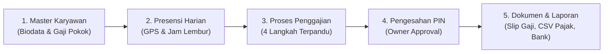

# 📖 Panduan Penggunaan CatatGaji (Payroll & HRIS SaaS)

Selamat datang di **CatatGaji**! Aplikasi ini dirancang untuk mempermudah perhitungan penggajian, absensi berbasis radius GPS, pemotongan 5 program BPJS, serta perhitungan pajak PPh 21 TER (PMK No. 168/2023 125 lapisan tarif) secara otomatis, akurat, dan sesuai dengan regulasi Republik Indonesia.

---

## 🗺️ Alur Kerja Utama (Workflow)



---

## ⚡ 1-Klik Uji Coba: Fitur Sandbox & Generator Data Mock

Jika Anda ingin langsung mencoba semua fitur tanpa harus menginput manual dari nol:

1. Buka menu samping: **`🛠️ Sandbox / Demo Data`** (atau buka `/settings?tab=DEBUG`).
2. Klik tombol **`🚀 Generate Data Mock Lengkap`**.
3. Sistem akan otomatis membuatkan:
   - **5 Karyawan Beragam** (Manager, Developer, Staff, Sales, Warehouse) dengan gaji Rp 5.2 jt – Rp 15 jt dan status PTKP berbeda (TK/0, K/1, TK/3).
   - **10 Hari Catatan Presensi & Absensi** (Presensi tepat waktu, terlambat, lembur 2 jam).
   - **1 Periode Penggajian Draf Aktif** yang siap dikalkulasi.
4. Anda juga dapat menggunakan tombol **`Reset Seluruh Data Uji Coba`** kapan saja untuk membersihkan database pengujian.

---

## 📌 Panduan Langkah Demi Langkah Penggunaan

---

### Langkah 1: Pengaturan Profil Perusahaan & PIN Pemilik
📍 **Menu: Pengaturan Sistem (`/settings`)**

1. **Profil Perusahaan & Pajak Badan:**
   - Masukkan **Nama Perusahaan**, **NPWP Badan**, Alamat, serta **Identitas Penandatangan Bukti Potong Pajak** (Nama & NIK). Data ini akan otomatis dicetak pada Bukti Potong Pajak 1721-A1 dan e-Bupot 21 DJP Online.
2. **Keamanan PIN Pengesahan:**
   - Masukkan **PIN 6-Digit** Pemilik (Owner). PIN ini digunakan untuk mengesahkan dan mengunci penggajian bulanan agar tidak dapat dimanipulasi setelah final.

---

### Langkah 2: Kantor Cabang & UMK Wilayah
📍 **Menu: Pengaturan Sistem (`/settings`) $\rightarrow$ Tab Cabang & UMK**

- Daftarkan lokasi kantor cabang Anda beserta nilai **UMK Wilayah** (contoh: *Kantor Pusat Jakarta - UMR Rp 5.067.381*).
- Sistem menggunakan batas UMK ini sebagai indikator kepatuhan upah minimum tenaga kerja.

---

### Langkah 3: Menambah & Mengelola Data Karyawan
📍 **Menu: Data Karyawan (`/employees`)**

Klik tombol **`+ Tambah Karyawan`** dan lengkapi 3 langkah wizard:

| Tahapan | Data yang Diisi | Penjelasan Teknis |
| :--- | :--- | :--- |
| **1. Biodata Pribadi** | Nama Lengkap, NIK KTP (16 Digit), Email, No. Telepon, Jenis Kelamin | NIK & Email harus unik per akun perusahaan. |
| **2. Hubungan Kerja** | Cabang Penempatan, Status Kerja (PKWTT Tetap / PKWT Kontrak), Tanggal Masuk | Menentukan hak kompensasi akhir kontrak PKWT. |
| **3. Pajak & Rekening** | Status PTKP (TK/0, K/1, K/2, dll), NPWP, Kelas Risiko JKK, Rekening Bank | **PTKP otomatis memetakan Kategori Tarif Efektif Rata-rata (TER A, B, atau C)**. |

---

### Langkah 4: Absensi GPS, Cuti & Lembur Harian
📍 **Menu: Kehadiran & Absensi (`/attendance`)** & **Portal Karyawan (`/portal-karyawan`)**

- **Presensi GPS:** Karyawan melakukan *Clock In* & *Clock Out* dari smartphone masing-masing dengan validasi jarak radius kantor.
- **Pengajuan Cuti & Lembur:** Karyawan mengajukan lembur/cuti via portal $\rightarrow$ Disetujui oleh Owner di menu **Pusat Persetujuan (`/approvals`)**.
- Jam lembur yang disetujui akan **otomatis dihitung uang lemburnya** sesuai rumus resmi Depnaker (PP No. 35/2021) saat kalkulasi penggajian bulanan.

---

### Langkah 5: Menjalankan Penggajian Bulanan (Payroll Wizard 4-Step)
📍 **Menu: Proses Penggajian (`/payroll`)**

Proses penggajian bulanan dilakukan dalam 4 langkah terpadu:

```
[ 1. Hitung Gaji Batch ] ──▶ [ 2. Input Variabel ] ──▶ [ 3. Tinjau Rekap ] ──▶ [ 4. Pengesahan PIN ]
```

1. **Buka Periode Penggajian:** Pilih periode draf bulan berjalan.
2. **Langkah 1 (Hitung Gaji Batch):** Klik tombol **"Mulai Hitung Payroll Otomatis"**.
   - Mesin kalkulasi akan menghitung Gaji Pokok, 5 Program BPJS (JHT, JKK, JKM, JP, BPJS Kes), dan Pajak PPh 21 TER 125 lapisan untuk seluruh karyawan secara instan.
3. **Langkah 2 (Input Komponen Variabel):**
   - Anda dapat memasukkan bonus, komisi, insentif, atau potongan kasbon/absen langsung pada tabel baris karyawan. Nilai PPh 21 TER dan THP akan otomatis terkalkulasi ulang secara *real-time*.
4. **Langkah 3 (Tinjau Rekapitulasi & Slip Gaji):**
   - Periksa ringkasan total beban perusahaan, total PPh 21 yang harus disetor ke kas negara, dan total gaji bersih karyawan.
   - Klik tombol **`Lihat Slip Gaji`** untuk melihat rincian dan mengunduh berkas **PDF Slip Gaji Resmi**.
5. **Langkah 4 (Pengesahan PIN Pemilik):**
   - Masukkan PIN 6-digit Owner untuk **mengunci periode penggajian**. Setelah disahkan, data terkunci permanen untuk audit keuangan.

---

### Langkah 6: Mengunduh Laporan Finansial, Pajak & Perbankan
📍 **Menu: Laporan Finansial & Pajak (`/tax-reports`)**

Setelah periode penggajian disahkan, Anda dapat mengekspor seluruh berkas kepatuhan hukum:

* 📄 **Bukti Potong PPh 21 Tahunan (Formulir 1721-A1 PDF):** Siap dibagikan ke karyawan untuk pelaporan SPT Tahunan Orang Pribadi.
* 📊 **Ekspor CSV e-Bupot 21/26 DJP:** Format CSV resmi yang siap diimpor langsung ke sistem DJP Online (*pajak.go.id*).
* 📑 **Jurnal Akuntansi PSAK (Mekari Jurnal / Accurate CSV):** Unduh berkas debet/kredit biaya gaji untuk diimpor ke sistem pembukuan perusahaan.
* 🏦 **Daftar Rekapitulasi Transfer Bank:** Daftar nomor rekening dan nominal transfer bersih (BCA, Mandiri, BRI, BNI).

---

### 🛡️ Kepatuhan Regulasi yang Terintegrasi di CatatGaji:

1. **PMK No. 168/2023 & UU HPP No. 7/2021:**
   - 125 Lapisan Tarif Efektif Rata-rata (TER Bulanan Kategori A, B, C).
   - Rekonsiliasi Tarif Pasal 17 ayat (1) huruf a pada masa pajak Desember / Masa Pajak Terakhir.
2. **BPJS Ketenagakerjaan (PP 44/2015, PP 45/2015, PP 46/2015):**
   - JHT (3.7% Perusahaan, 2.0% Karyawan)
   - JKK (5 Kelas Risiko: 0.24%, 0.54%, 0.89%, 1.27%, 1.74%)
   - JKM (0.3% Perusahaan)
   - JP (2.0% Perusahaan, 1.0% Karyawan, Plafon Rp 10.042.300)
3. **BPJS Kesehatan (Perpres 64/2020):**
   - 4.0% Perusahaan, 1.0% Karyawan, Batas Atas Upah Rp 12.000.000.
4. **PP No. 35/2021:**
   - Perhitungan Lembur jam kerja (upah per jam = 1/173 × Upah Sebulan).
   - Kompensasi berakhirnya masa kontrak kerja PKWT.
5. **UU Perlindungan Data Pribadi (UU PDP No. 27/2022):**
   - Masking otomatis NIK KTP & Nomor Rekening Bank.
   - Catatan Log Audit Forensik (*Immutable Append-Only*).
