# DOKUMEN PERSYARATAN PRODUK (PRD) — CATATGAJI
## 07. DATA MODEL & ARSITEKTUR DATABASE (ERD MULTI-TENANT)

---

### 1. Arsitektur Database Multi-Tenant & Row-Level Security (RLS)

CatatGaji menggunakan arsitektur **Shared Database, Shared Schema with PostgreSQL 16+ Row-Level Security (RLS)**. Setiap tabel bisnis wajib memiliki kolom referensi penyewa:
`tenant_id UUID NOT NULL REFERENCES tenants(id) ON DELETE CASCADE`.

```
+----------------------------------------------------------------------------------------------------+
|                                MEKANISME POSTGRESQL ROW-LEVEL SECURITY                             |
+----------------------------------------------------------------------------------------------------+
|  [ APLIKASI WEB / API ]                                                                            |
|        |                                                                                           |
|        v  (Koneksi Database Pooler: SET LOCAL app.current_tenant_id = '018dc3f2-...')               |
|  [ POSTGRESQL 16+ ENGINE ]                                                                         |
|        |                                                                                           |
|        +---> [ FUNCTION: current_tenant_id() RETURNS UUID ]                                        |
|        |                                                                                           |
|        +---> [ RLS POLICY: tenant_isolation_policy ON employees ]                                  |
|              * USING (tenant_id = current_tenant_id())                                             |
|              * WITH CHECK (tenant_id = current_tenant_id())                                        |
|                                                                                                    |
|  [ HASIL: Kueri SELECT/UPDATE/DELETE HANYA membaca & memodifikasi data milik tenant aktif ]        |
+----------------------------------------------------------------------------------------------------+
```

---

### 2. Diagram Entity Relationship (ERD)

```mermaid
erDiagram
    tenants ||--o{ users : "has"
    tenants ||--o{ roles_permissions : "defines"
    tenants ||--o{ branches_departments : "contains"
    tenants ||--o{ employees : "employs"
    tenants ||--o{ shifts_schedules : "configures"
    tenants ||--o{ leave_types : "configures"
    tenants ||--o{ payroll_periods : "executes"
    tenants ||--o{ tax_reports_e_bupot : "files"
    tenants ||--o{ audit_logs : "records"

    users ||--o| employees : "linked_to"
    roles_permissions ||--o{ users : "assigned_to"
    branches_departments ||--o{ employees : "assigned_branch"
    branches_departments ||--o{ employees : "assigned_dept"

    employees ||--o{ employee_salaries : "has_salary_history"
    employees ||--o{ attendances : "clocks"
    employees ||--o{ leave_requests : "submits_leave"
    employees ||--o{ overtime_requests : "submits_overtime"
    employees ||--o{ payroll_items : "receives_payroll"

    shifts_schedules ||--o{ attendances : "scheduled_for"
    leave_types ||--o{ leave_requests : "categorizes"

    payroll_periods ||--o{ payroll_items : "contains"
    payroll_items ||--|| payslips : "generates"

    tenants {
        uuid id PK
        varchar name
        varchar slug UK
        varchar tier
        varchar status
        jsonb settings_json
        timestamptz deleted_at
        timestamptz created_at
        timestamptz updated_at
    }

    users {
        uuid id PK
        uuid tenant_id FK
        varchar email
        varchar password_hash
        varchar role
        uuid employee_id FK
        boolean is_active
        timestamptz last_login_at
        timestamptz created_at
        timestamptz updated_at
    }

    roles_permissions {
        uuid id PK
        uuid tenant_id FK
        varchar role_name
        text[] permissions_array
        text description
        timestamptz created_at
        timestamptz updated_at
    }

    branches_departments {
        uuid id PK
        uuid tenant_id FK
        varchar name
        varchar type
        varchar code
        uuid parent_id FK
        text address
        numeric latitude
        numeric longitude
        integer radius_meters
        timestamptz created_at
        timestamptz updated_at
    }

    employees {
        uuid id PK
        uuid tenant_id FK
        varchar nik_ktp
        varchar npwp
        varchar bpjs_kes_no
        varchar bpjs_tk_no
        varchar full_name
        varchar email
        varchar phone
        uuid branch_id FK
        uuid department_id FK
        date join_date
        date resign_date
        varchar employment_status
        varchar ptkp_status
        varchar salary_type
        varchar bank_name
        varchar bank_account_no
        varchar bank_account_holder
        varchar status
        timestamptz deleted_at
        timestamptz created_at
        timestamptz updated_at
    }

    employee_salaries {
        uuid id PK
        uuid tenant_id FK
        uuid employee_id FK
        numeric basic_salary
        jsonb fixed_allowances_json
        jsonb non_fixed_allowances_json
        smallint jkk_risk_grade
        boolean bpjs_kes_override
        varchar pph21_scheme
        date effective_date
        boolean is_current
        timestamptz deleted_at
        timestamptz created_at
        timestamptz updated_at
    }

    shifts_schedules {
        uuid id PK
        uuid tenant_id FK
        varchar name
        varchar code
        time start_time
        time end_time
        time break_start
        time break_end
        smallint break_duration_minutes
        smallint[] work_days
        smallint grace_period_minutes
        timestamptz created_at
        timestamptz updated_at
    }

    attendances {
        uuid id PK
        uuid tenant_id FK
        uuid employee_id FK
        uuid shift_id FK
        date date
        time check_in_time
        time check_out_time
        smallint late_minutes
        smallint early_leave_minutes
        numeric work_hours
        varchar status
        numeric check_in_latitude
        numeric check_in_longitude
        numeric check_out_latitude
        numeric check_out_longitude
        text selfie_url
        text notes
        boolean is_overtime_applied
        timestamptz created_at
        timestamptz updated_at
    }

    leave_types {
        uuid id PK
        uuid tenant_id FK
        varchar name
        varchar code
        smallint default_quota
        boolean is_paid
        varchar gender_restriction
        boolean requires_attachment
        smallint max_consecutive_days
        timestamptz created_at
        timestamptz updated_at
    }

    leave_requests {
        uuid id PK
        uuid tenant_id FK
        uuid employee_id FK
        uuid leave_type_id FK
        date start_date
        date end_date
        numeric total_days
        text reason
        text attachment_url
        varchar status
        uuid approved_by FK
        timestamptz approved_at
        text rejection_reason
        timestamptz created_at
        timestamptz updated_at
    }

    overtime_requests {
        uuid id PK
        uuid tenant_id FK
        uuid employee_id FK
        date date
        time start_time
        time end_time
        numeric total_hours
        jsonb rate_multiplier_breakdown_json
        text task_description
        varchar spkl_no
        varchar status
        uuid approved_by FK
        timestamptz approved_at
        text rejection_reason
        timestamptz created_at
        timestamptz updated_at
    }

    payroll_periods {
        uuid id PK
        uuid tenant_id FK
        varchar name
        smallint month
        integer year
        date start_date
        date end_date
        date payment_date
        date cutoff_date
        varchar status
        numeric total_gross
        numeric total_net
        numeric total_tax
        numeric total_bpjs_company
        numeric total_bpjs_employee
        integer total_employees
        uuid approved_by FK
        timestamptz approved_at
        timestamptz created_at
        timestamptz updated_at
    }

    payroll_items {
        uuid id PK
        uuid tenant_id FK
        uuid payroll_period_id FK
        uuid employee_id FK
        numeric basic_salary
        numeric fixed_allowance
        numeric non_fixed_allowance
        numeric overtime_pay
        numeric bonus_thr
        numeric reimbursement
        numeric jkk_company
        numeric jkm_company
        numeric jht_company
        numeric jp_company
        numeric bpjs_kes_company
        numeric gross_income
        numeric jht_employee
        numeric jp_employee
        numeric bpjs_kes_employee
        varchar pph21_ter_category
        numeric pph21_ter_rate
        numeric pph21_amount
        numeric deductions_other
        numeric take_home_pay
        jsonb calculation_snapshot_json
        timestamptz created_at
        timestamptz updated_at
    }

    payslips {
        uuid id PK
        uuid tenant_id FK
        uuid payroll_item_id FK
        varchar slip_number
        varchar access_pin_hash
        text pdf_url
        text encrypted_pdf_key
        timestamptz sent_email_at
        timestamptz sent_wa_at
        timestamptz downloaded_at
        timestamptz created_at
        timestamptz updated_at
    }

    tax_reports_e_bupot {
        uuid id PK
        uuid tenant_id FK
        smallint tax_period_month
        integer tax_period_year
        integer total_taxpayers
        numeric total_taxable_gross
        numeric total_pph21_withheld
        varchar status
        text djp_csv_export_url
        jsonb ebupot_json
        timestamptz created_at
        timestamptz updated_at
    }

    audit_logs {
        uuid id PK
        uuid tenant_id FK
        uuid user_id FK
        varchar action
        varchar entity_type
        uuid entity_id
        jsonb old_values_json
        jsonb new_values_json
        inet ip_address
        text user_agent
        timestamptz created_at
    }
```



---

### 3. Kamus Data & Definisi Skema DDL Lengkap (16 Tabel)

```sql
-- Ekstensi Inti PostgreSQL
CREATE EXTENSION IF NOT EXISTS "uuid-ossp";
CREATE EXTENSION IF NOT EXISTS "pgcrypto";

-- Definisi Enum Types
CREATE TYPE tenant_tier_enum AS ENUM ('STARTER', 'GROWTH', 'ENTERPRISE');
CREATE TYPE tenant_status_enum AS ENUM ('ACTIVE', 'SUSPENDED', 'TRIAL', 'EXPIRED');
CREATE TYPE user_role_enum AS ENUM ('SUPER_ADMIN', 'COMPANY_OWNER', 'HR_ADMIN', 'FINANCE_PAYROLL', 'BRANCH_MANAGER', 'EMPLOYEE');
CREATE TYPE branch_type_enum AS ENUM ('HEAD_OFFICE', 'BRANCH_OFFICE', 'STORE_OUTLET', 'FACTORY', 'WAREHOUSE');
CREATE TYPE employment_status_enum AS ENUM ('PKWTT', 'PKWT', 'FREELANCE', 'INTERNSHIP', 'EXPATRIATE');
CREATE TYPE ptkp_status_enum AS ENUM ('TK/0', 'TK/1', 'TK/2', 'TK/3', 'K/0', 'K/1', 'K/2', 'K/3');
CREATE TYPE salary_type_enum AS ENUM ('MONTHLY', 'DAILY', 'HOURLY', 'PIECE_RATE');
CREATE TYPE employee_status_enum AS ENUM ('ACTIVE', 'PROBATION', 'SUSPENDED', 'RESIGNED', 'TERMINATED');
CREATE TYPE attendance_status_enum AS ENUM ('PRESENT', 'LATE', 'EARLY_LEAVE', 'ABSENT', 'ON_LEAVE', 'HOLIDAY', 'BUSINESS_TRIP');
CREATE TYPE leave_status_enum AS ENUM ('PENDING', 'APPROVED', 'REJECTED', 'CANCELLED');
CREATE TYPE overtime_status_enum AS ENUM ('PENDING', 'APPROVED', 'REJECTED', 'CANCELLED');
CREATE TYPE payroll_status_enum AS ENUM ('DRAFT', 'CALCULATING', 'REVIEW', 'APPROVED', 'PAID', 'LOCKED');
CREATE TYPE tax_report_status_enum AS ENUM ('DRAFT', 'GENERATED', 'VALIDATED', 'SUBMITTED');
CREATE TYPE gender_enum AS ENUM ('ALL', 'MALE', 'FEMALE');

-- -------------------------------------------------------------
-- 1. TABEL: tenants (Entitas Induk Penyewa Organisasi)
-- -------------------------------------------------------------
CREATE TABLE tenants (
    id UUID PRIMARY KEY DEFAULT gen_random_uuid(),
    name VARCHAR(255) NOT NULL,
    slug VARCHAR(100) NOT NULL UNIQUE,
    tier tenant_tier_enum NOT NULL DEFAULT 'STARTER',
    status tenant_status_enum NOT NULL DEFAULT 'TRIAL',
    settings_json JSONB NOT NULL DEFAULT '{
        "currency": "IDR",
        "timezone": "Asia/Jakarta",
        "work_days_per_week": 5,
        "default_jkk_grade": 2,
        "bpjs_kesehatan_enabled": true,
        "bpjs_tk_enabled": true,
        "overtime_calculation_enabled": true,
        "pph21_method": "TER_MONTHLY"
    }'::jsonb,
    trial_ends_at TIMESTAMPTZ,
    deleted_at TIMESTAMPTZ DEFAULT NULL, -- Soft delete untuk mendukung sinkronisasi multi-device dan pemulihan data. Record dengan deleted_at tidak ditampilkan di UI tetapi tetap tersedia untuk sync dan audit.
    version INTEGER NOT NULL DEFAULT 1, -- Optimistic locking untuk sync protocol (PRD 08). Server menolak update jika version mismatch.
    created_at TIMESTAMPTZ NOT NULL DEFAULT CURRENT_TIMESTAMP,
    updated_at TIMESTAMPTZ NOT NULL DEFAULT CURRENT_TIMESTAMP
);
CREATE INDEX idx_tenants_slug ON tenants(slug);
CREATE INDEX idx_tenants_status ON tenants(status);

-- -------------------------------------------------------------
-- 2. TABEL: users (Akun Pengguna Aplikasi)
-- -------------------------------------------------------------
CREATE TABLE users (
    id UUID PRIMARY KEY DEFAULT gen_random_uuid(),
    tenant_id UUID NOT NULL REFERENCES tenants(id) ON DELETE CASCADE,
    email VARCHAR(255) NOT NULL,
    password_hash VARCHAR(255) NOT NULL,
    role user_role_enum NOT NULL DEFAULT 'EMPLOYEE',
    employee_id UUID, -- Foreign key ditautkan ke employees
    is_active BOOLEAN NOT NULL DEFAULT TRUE,
    last_login_at TIMESTAMPTZ,
    created_at TIMESTAMPTZ NOT NULL DEFAULT CURRENT_TIMESTAMP,
    updated_at TIMESTAMPTZ NOT NULL DEFAULT CURRENT_TIMESTAMP,
    CONSTRAINT uq_users_tenant_email UNIQUE(tenant_id, email)
);
CREATE INDEX idx_users_tenant_id ON users(tenant_id);
CREATE INDEX idx_users_email ON users(email);

-- -------------------------------------------------------------
-- 3. TABEL: roles_permissions (Konfigurasi Izin Granular RBAC)
-- -------------------------------------------------------------
CREATE TABLE roles_permissions (
    id UUID PRIMARY KEY DEFAULT gen_random_uuid(),
    tenant_id UUID NOT NULL REFERENCES tenants(id) ON DELETE CASCADE,
    role_name VARCHAR(100) NOT NULL,
    permissions_array TEXT[] NOT NULL DEFAULT '{}',
    description TEXT,
    created_at TIMESTAMPTZ NOT NULL DEFAULT CURRENT_TIMESTAMP,
    updated_at TIMESTAMPTZ NOT NULL DEFAULT CURRENT_TIMESTAMP,
    CONSTRAINT uq_roles_tenant_name UNIQUE(tenant_id, role_name)
);
CREATE INDEX idx_roles_permissions_tenant_id ON roles_permissions(tenant_id);

-- -------------------------------------------------------------
-- 4. TABEL: branches_departments (Struktur Cabang & Unit Kerja)
-- -------------------------------------------------------------
CREATE TABLE branches_departments (
    id UUID PRIMARY KEY DEFAULT gen_random_uuid(),
    tenant_id UUID NOT NULL REFERENCES tenants(id) ON DELETE CASCADE,
    name VARCHAR(200) NOT NULL,
    type branch_type_enum NOT NULL DEFAULT 'HEAD_OFFICE',
    code VARCHAR(50) NOT NULL,
    parent_id UUID REFERENCES branches_departments(id) ON DELETE SET NULL,
    address TEXT,
    latitude NUMERIC(10, 7),
    longitude NUMERIC(10, 7),
    radius_meters INTEGER NOT NULL DEFAULT 100,
    created_at TIMESTAMPTZ NOT NULL DEFAULT CURRENT_TIMESTAMP,
    updated_at TIMESTAMPTZ NOT NULL DEFAULT CURRENT_TIMESTAMP,
    CONSTRAINT uq_branches_tenant_code UNIQUE(tenant_id, code)
);
CREATE INDEX idx_branches_tenant_id ON branches_departments(tenant_id);
CREATE INDEX idx_branches_parent_id ON branches_departments(parent_id);

-- -------------------------------------------------------------
-- 5. TABEL: employees (Master Biodata Karyawan)
-- -------------------------------------------------------------
CREATE TABLE employees (
    id UUID PRIMARY KEY DEFAULT gen_random_uuid(),
    tenant_id UUID NOT NULL REFERENCES tenants(id) ON DELETE CASCADE,
    nik_ktp VARCHAR(20) NOT NULL, -- Enkripsi level storage
    npwp VARCHAR(25),             -- 15 / 16 digit
    bpjs_kes_no VARCHAR(20),
    bpjs_tk_no VARCHAR(20),
    full_name VARCHAR(255) NOT NULL,
    email VARCHAR(255) NOT NULL,
    phone VARCHAR(25),
    branch_id UUID REFERENCES branches_departments(id) ON DELETE RESTRICT,
    department_id UUID REFERENCES branches_departments(id) ON DELETE SET NULL,
    join_date DATE NOT NULL,
    resign_date DATE,
    employment_status employment_status_enum NOT NULL DEFAULT 'PKWTT',
    ptkp_status ptkp_status_enum NOT NULL DEFAULT 'TK/0',
    salary_type salary_type_enum NOT NULL DEFAULT 'MONTHLY',
    bank_name VARCHAR(100) NOT NULL DEFAULT 'BCA',
    bank_account_no VARCHAR(50) NOT NULL,
    bank_account_holder VARCHAR(255) NOT NULL,
    status employee_status_enum NOT NULL DEFAULT 'ACTIVE',
    deleted_at TIMESTAMPTZ DEFAULT NULL, -- Soft delete untuk mendukung sinkronisasi multi-device dan pemulihan data. Record dengan deleted_at tidak ditampilkan di UI tetapi tetap tersedia untuk sync dan audit.
    version INTEGER NOT NULL DEFAULT 1, -- Optimistic locking untuk sync protocol (PRD 08)
    created_at TIMESTAMPTZ NOT NULL DEFAULT CURRENT_TIMESTAMP,
    updated_at TIMESTAMPTZ NOT NULL DEFAULT CURRENT_TIMESTAMP,
    CONSTRAINT uq_employees_tenant_nik UNIQUE(tenant_id, nik_ktp),
    CONSTRAINT uq_employees_tenant_email UNIQUE(tenant_id, email)
);
CREATE INDEX idx_employees_tenant_id ON employees(tenant_id);
CREATE INDEX idx_employees_status ON employees(status);
CREATE INDEX idx_employees_branch ON employees(branch_id);
CREATE INDEX idx_employees_dept ON employees(department_id);

-- Relasi foreign key balik dari users ke employees
ALTER TABLE users ADD CONSTRAINT fk_users_employee FOREIGN KEY (employee_id) REFERENCES employees(id) ON DELETE SET NULL;

-- -------------------------------------------------------------
-- 6. TABEL: employee_salaries (Riwayat Kompensasi & Gaji Pokok)
-- -------------------------------------------------------------
CREATE TABLE employee_salaries (
    id UUID PRIMARY KEY DEFAULT gen_random_uuid(),
    tenant_id UUID NOT NULL REFERENCES tenants(id) ON DELETE CASCADE,
    employee_id UUID NOT NULL REFERENCES employees(id) ON DELETE CASCADE,
    basic_salary NUMERIC(15, 2) NOT NULL CHECK (basic_salary >= 0),
    fixed_allowances_json JSONB NOT NULL DEFAULT '[]'::jsonb,
    non_fixed_allowances_json JSONB NOT NULL DEFAULT '[]'::jsonb,
    jkk_risk_grade SMALLINT NOT NULL DEFAULT 2 CHECK (jkk_risk_grade BETWEEN 1 AND 5),
    bpjs_kes_override BOOLEAN NOT NULL DEFAULT FALSE,
    pph21_scheme VARCHAR(50) NOT NULL DEFAULT 'TER_MONTHLY',
    effective_date DATE NOT NULL,
    is_current BOOLEAN NOT NULL DEFAULT TRUE,
    deleted_at TIMESTAMPTZ DEFAULT NULL, -- Soft delete untuk mendukung sinkronisasi multi-device dan pemulihan data. Record dengan deleted_at tidak ditampilkan di UI tetapi tetap tersedia untuk sync dan audit.
    version INTEGER NOT NULL DEFAULT 1, -- Optimistic locking untuk sync protocol (PRD 08)
    created_at TIMESTAMPTZ NOT NULL DEFAULT CURRENT_TIMESTAMP,
    updated_at TIMESTAMPTZ NOT NULL DEFAULT CURRENT_TIMESTAMP
);
CREATE INDEX idx_salaries_tenant_emp ON employee_salaries(tenant_id, employee_id);
CREATE INDEX idx_salaries_is_current ON employee_salaries(is_current);

-- -------------------------------------------------------------
-- 7. TABEL: shifts_schedules (Jadwal Kerja & Shift)
-- -------------------------------------------------------------
CREATE TABLE shifts_schedules (
    id UUID PRIMARY KEY DEFAULT gen_random_uuid(),
    tenant_id UUID NOT NULL REFERENCES tenants(id) ON DELETE CASCADE,
    name VARCHAR(100) NOT NULL,
    code VARCHAR(30) NOT NULL,
    start_time TIME NOT NULL,
    end_time TIME NOT NULL,
    break_start TIME,
    break_end TIME,
    break_duration_minutes SMALLINT NOT NULL DEFAULT 60,
    work_days SMALLINT[] NOT NULL DEFAULT '{1,2,3,4,5}',
    grace_period_minutes SMALLINT NOT NULL DEFAULT 15,
    created_at TIMESTAMPTZ NOT NULL DEFAULT CURRENT_TIMESTAMP,
    updated_at TIMESTAMPTZ NOT NULL DEFAULT CURRENT_TIMESTAMP,
    CONSTRAINT uq_shifts_tenant_code UNIQUE(tenant_id, code)
);
CREATE INDEX idx_shifts_tenant_id ON shifts_schedules(tenant_id);

-- -------------------------------------------------------------
-- 8. TABEL: attendances (Log Transaksi Kehadiran Harian)
-- -------------------------------------------------------------
CREATE TABLE attendances (
    id UUID PRIMARY KEY DEFAULT gen_random_uuid(),
    tenant_id UUID NOT NULL REFERENCES tenants(id) ON DELETE CASCADE,
    employee_id UUID NOT NULL REFERENCES employees(id) ON DELETE CASCADE,
    shift_id UUID REFERENCES shifts_schedules(id) ON DELETE SET NULL,
    date DATE NOT NULL,
    check_in_time TIME,
    check_out_time TIME,
    late_minutes SMALLINT NOT NULL DEFAULT 0,
    early_leave_minutes SMALLINT NOT NULL DEFAULT 0,
    work_hours NUMERIC(4, 2) NOT NULL DEFAULT 0.00,
    status attendance_status_enum NOT NULL DEFAULT 'PRESENT',
    check_in_latitude NUMERIC(10, 7),
    check_in_longitude NUMERIC(10, 7),
    check_out_latitude NUMERIC(10, 7),
    check_out_longitude NUMERIC(10, 7),
    selfie_url TEXT,
    notes TEXT,
    is_overtime_applied BOOLEAN NOT NULL DEFAULT FALSE,
    created_at TIMESTAMPTZ NOT NULL DEFAULT CURRENT_TIMESTAMP,
    updated_at TIMESTAMPTZ NOT NULL DEFAULT CURRENT_TIMESTAMP,
    CONSTRAINT uq_attendances_tenant_emp_date UNIQUE(tenant_id, employee_id, date)
);
CREATE INDEX idx_attendances_tenant_emp ON attendances(tenant_id, employee_id);
CREATE INDEX idx_attendances_date ON attendances(date);
CREATE INDEX idx_attendances_status ON attendances(status);

-- -------------------------------------------------------------
-- 9. TABEL: leave_types (Master Jenis Cuti & Kebijakan)
-- -------------------------------------------------------------
CREATE TABLE leave_types (
    id UUID PRIMARY KEY DEFAULT gen_random_uuid(),
    tenant_id UUID NOT NULL REFERENCES tenants(id) ON DELETE CASCADE,
    name VARCHAR(100) NOT NULL,
    code VARCHAR(30) NOT NULL,
    default_quota SMALLINT NOT NULL DEFAULT 12,
    is_paid BOOLEAN NOT NULL DEFAULT TRUE,
    gender_restriction gender_enum NOT NULL DEFAULT 'ALL',
    requires_attachment BOOLEAN NOT NULL DEFAULT FALSE,
    max_consecutive_days SMALLINT NOT NULL DEFAULT 12,
    created_at TIMESTAMPTZ NOT NULL DEFAULT CURRENT_TIMESTAMP,
    updated_at TIMESTAMPTZ NOT NULL DEFAULT CURRENT_TIMESTAMP,
    CONSTRAINT uq_leaves_tenant_code UNIQUE(tenant_id, code)
);
CREATE INDEX idx_leave_types_tenant_id ON leave_types(tenant_id);

-- -------------------------------------------------------------
-- 10. TABEL: leave_requests (Permohonan Cuti & Izin Karyawan)
-- -------------------------------------------------------------
CREATE TABLE leave_requests (
    id UUID PRIMARY KEY DEFAULT gen_random_uuid(),
    tenant_id UUID NOT NULL REFERENCES tenants(id) ON DELETE CASCADE,
    employee_id UUID NOT NULL REFERENCES employees(id) ON DELETE CASCADE,
    leave_type_id UUID NOT NULL REFERENCES leave_types(id) ON DELETE RESTRICT,
    start_date DATE NOT NULL,
    end_date DATE NOT NULL,
    total_days NUMERIC(4, 1) NOT NULL CHECK (total_days > 0),
    reason TEXT NOT NULL,
    attachment_url TEXT,
    status leave_status_enum NOT NULL DEFAULT 'PENDING',
    approved_by UUID REFERENCES users(id) ON DELETE SET NULL,
    approved_at TIMESTAMPTZ,
    rejection_reason TEXT,
    created_at TIMESTAMPTZ NOT NULL DEFAULT CURRENT_TIMESTAMP,
    updated_at TIMESTAMPTZ NOT NULL DEFAULT CURRENT_TIMESTAMP
);
CREATE INDEX idx_leave_req_tenant_emp ON leave_requests(tenant_id, employee_id);
CREATE INDEX idx_leave_req_status ON leave_requests(status);
CREATE INDEX idx_leave_req_dates ON leave_requests(start_date, end_date);

-- -------------------------------------------------------------
-- 11. TABEL: overtime_requests (Surat Perintah Kerja Lembur / SPKL)
-- -------------------------------------------------------------
CREATE TABLE overtime_requests (
    id UUID PRIMARY KEY DEFAULT gen_random_uuid(),
    tenant_id UUID NOT NULL REFERENCES tenants(id) ON DELETE CASCADE,
    employee_id UUID NOT NULL REFERENCES employees(id) ON DELETE CASCADE,
    date DATE NOT NULL,
    start_time TIME NOT NULL,
    end_time TIME NOT NULL,
    total_hours NUMERIC(4, 2) NOT NULL CHECK (total_hours > 0),
    rate_multiplier_breakdown_json JSONB NOT NULL DEFAULT '{}'::jsonb,
    task_description TEXT NOT NULL,
    spkl_no VARCHAR(100) NOT NULL,
    status overtime_status_enum NOT NULL DEFAULT 'PENDING',
    approved_by UUID REFERENCES users(id) ON DELETE SET NULL,
    approved_at TIMESTAMPTZ,
    rejection_reason TEXT,
    created_at TIMESTAMPTZ NOT NULL DEFAULT CURRENT_TIMESTAMP,
    updated_at TIMESTAMPTZ NOT NULL DEFAULT CURRENT_TIMESTAMP,
    CONSTRAINT uq_overtime_tenant_spkl UNIQUE(tenant_id, spkl_no)
);
CREATE INDEX idx_overtime_tenant_emp ON overtime_requests(tenant_id, employee_id);
CREATE INDEX idx_overtime_status ON overtime_requests(status);
CREATE INDEX idx_overtime_date ON overtime_requests(date);

-- -------------------------------------------------------------
-- 12. TABEL: payroll_periods (Periode Penggajian Bulanan)
-- -------------------------------------------------------------
CREATE TABLE payroll_periods (
    id UUID PRIMARY KEY DEFAULT gen_random_uuid(),
    tenant_id UUID NOT NULL REFERENCES tenants(id) ON DELETE CASCADE,
    name VARCHAR(150) NOT NULL,
    month SMALLINT NOT NULL CHECK (month BETWEEN 1 AND 12),
    year INTEGER NOT NULL CHECK (year >= 2020),
    start_date DATE NOT NULL,
    end_date DATE NOT NULL,
    payment_date DATE NOT NULL,
    cutoff_date DATE NOT NULL,
    status payroll_status_enum NOT NULL DEFAULT 'DRAFT',
    total_gross NUMERIC(18, 2) NOT NULL DEFAULT 0.00,
    total_net NUMERIC(18, 2) NOT NULL DEFAULT 0.00,
    total_tax NUMERIC(18, 2) NOT NULL DEFAULT 0.00,
    total_bpjs_company NUMERIC(18, 2) NOT NULL DEFAULT 0.00,
    total_bpjs_employee NUMERIC(18, 2) NOT NULL DEFAULT 0.00,
    total_employees INTEGER NOT NULL DEFAULT 0,
    approved_by UUID REFERENCES users(id) ON DELETE SET NULL,
    approved_at TIMESTAMPTZ,
    created_at TIMESTAMPTZ NOT NULL DEFAULT CURRENT_TIMESTAMP,
    updated_at TIMESTAMPTZ NOT NULL DEFAULT CURRENT_TIMESTAMP,
    CONSTRAINT uq_periods_tenant_month_year UNIQUE(tenant_id, month, year)
);
CREATE INDEX idx_periods_tenant_id ON payroll_periods(tenant_id);
CREATE INDEX idx_periods_status ON payroll_periods(status);

-- -------------------------------------------------------------
-- 13. TABEL: payroll_items (Rincian Kompensasi & Pajak per Karyawan)
-- -------------------------------------------------------------
CREATE TABLE payroll_items (
    id UUID PRIMARY KEY DEFAULT gen_random_uuid(),
    tenant_id UUID NOT NULL REFERENCES tenants(id) ON DELETE CASCADE,
    payroll_period_id UUID NOT NULL REFERENCES payroll_periods(id) ON DELETE CASCADE,
    employee_id UUID NOT NULL REFERENCES employees(id) ON DELETE RESTRICT,
    
    -- Komponen Penghasilan Bruto
    basic_salary NUMERIC(15, 2) NOT NULL DEFAULT 0.00,
    fixed_allowance NUMERIC(15, 2) NOT NULL DEFAULT 0.00,
    non_fixed_allowance NUMERIC(15, 2) NOT NULL DEFAULT 0.00,
    overtime_pay NUMERIC(15, 2) NOT NULL DEFAULT 0.00,
    bonus_thr NUMERIC(15, 2) NOT NULL DEFAULT 0.00,
    reimbursement NUMERIC(15, 2) NOT NULL DEFAULT 0.00,
    
    -- Iuran Ditanggung Perusahaan (Penambah Bruto Pajak)
    jkk_company NUMERIC(15, 2) NOT NULL DEFAULT 0.00,
    jkm_company NUMERIC(15, 2) NOT NULL DEFAULT 0.00,
    jht_company NUMERIC(15, 2) NOT NULL DEFAULT 0.00,
    jp_company NUMERIC(15, 2) NOT NULL DEFAULT 0.00,
    bpjs_kes_company NUMERIC(15, 2) NOT NULL DEFAULT 0.00,
    
    -- Total Penghasilan Bruto
    gross_income NUMERIC(15, 2) NOT NULL DEFAULT 0.00,
    
    -- Potongan BPJS Karyawan
    jht_employee NUMERIC(15, 2) NOT NULL DEFAULT 0.00,
    jp_employee NUMERIC(15, 2) NOT NULL DEFAULT 0.00,
    bpjs_kes_employee NUMERIC(15, 2) NOT NULL DEFAULT 0.00,
    
    -- Pajak PPh 21 TER 2024
    pph21_ter_category VARCHAR(1) CHECK (pph21_ter_category IN ('A', 'B', 'C')),
    pph21_ter_rate NUMERIC(5, 4) NOT NULL DEFAULT 0.0000,
    pph21_amount NUMERIC(15, 2) NOT NULL DEFAULT 0.00,
    
    -- Potongan Lain & THP Bersih
    deductions_other NUMERIC(15, 2) NOT NULL DEFAULT 0.00,
    take_home_pay NUMERIC(15, 2) NOT NULL DEFAULT 0.00,
    
    -- Snapshot Audit Immutable (JSONB)
    calculation_snapshot_json JSONB NOT NULL DEFAULT '{}'::jsonb,
    
    created_at TIMESTAMPTZ NOT NULL DEFAULT CURRENT_TIMESTAMP,
    updated_at TIMESTAMPTZ NOT NULL DEFAULT CURRENT_TIMESTAMP,
    CONSTRAINT uq_payroll_items_period_emp UNIQUE(tenant_id, payroll_period_id, employee_id)
);
CREATE INDEX idx_payroll_items_tenant_period ON payroll_items(tenant_id, payroll_period_id);
CREATE INDEX idx_payroll_items_emp ON payroll_items(employee_id);
CREATE INDEX idx_payroll_snapshot ON payroll_items USING GIN (calculation_snapshot_json);

-- -------------------------------------------------------------
-- 14. TABEL: payslips (Slip Gaji Digital Terenkripsi Password)
-- -------------------------------------------------------------
CREATE TABLE payslips (
    id UUID PRIMARY KEY DEFAULT gen_random_uuid(),
    tenant_id UUID NOT NULL REFERENCES tenants(id) ON DELETE CASCADE,
    payroll_item_id UUID NOT NULL UNIQUE REFERENCES payroll_items(id) ON DELETE CASCADE,
    slip_number VARCHAR(100) NOT NULL,
    access_pin_hash VARCHAR(255) NOT NULL,
    pdf_url TEXT NOT NULL,
    encrypted_pdf_key TEXT,
    sent_email_at TIMESTAMPTZ,
    sent_wa_at TIMESTAMPTZ,
    downloaded_at TIMESTAMPTZ,
    created_at TIMESTAMPTZ NOT NULL DEFAULT CURRENT_TIMESTAMP,
    updated_at TIMESTAMPTZ NOT NULL DEFAULT CURRENT_TIMESTAMP,
    CONSTRAINT uq_payslips_tenant_slip_no UNIQUE(tenant_id, slip_number)
);
CREATE INDEX idx_payslips_tenant_id ON payslips(tenant_id);
CREATE INDEX idx_payslips_payroll_item ON payslips(payroll_item_id);

-- -------------------------------------------------------------
-- 15. TABEL: tax_reports_e_bupot (Arsip Laporan Pajak DJP)
-- -------------------------------------------------------------
CREATE TABLE tax_reports_e_bupot (
    id UUID PRIMARY KEY DEFAULT gen_random_uuid(),
    tenant_id UUID NOT NULL REFERENCES tenants(id) ON DELETE CASCADE,
    tax_period_month SMALLINT NOT NULL CHECK (tax_period_month BETWEEN 1 AND 12),
    tax_period_year INTEGER NOT NULL CHECK (tax_period_year >= 2020),
    total_taxpayers INTEGER NOT NULL DEFAULT 0,
    total_taxable_gross NUMERIC(18, 2) NOT NULL DEFAULT 0.00,
    total_pph21_withheld NUMERIC(18, 2) NOT NULL DEFAULT 0.00,
    status tax_report_status_enum NOT NULL DEFAULT 'DRAFT',
    djp_csv_export_url TEXT,
    ebupot_json JSONB NOT NULL DEFAULT '{}'::jsonb,
    created_at TIMESTAMPTZ NOT NULL DEFAULT CURRENT_TIMESTAMP,
    updated_at TIMESTAMPTZ NOT NULL DEFAULT CURRENT_TIMESTAMP,
    CONSTRAINT uq_tax_reports_tenant_period UNIQUE(tenant_id, tax_period_month, tax_period_year)
);
CREATE INDEX idx_tax_reports_tenant_id ON tax_reports_e_bupot(tenant_id);

-- -------------------------------------------------------------
-- 16. TABEL: audit_logs (Catatan Audit Forensik Append-Only)
-- -------------------------------------------------------------
CREATE TABLE audit_logs (
    id UUID PRIMARY KEY DEFAULT gen_random_uuid(),
    tenant_id UUID NOT NULL REFERENCES tenants(id) ON DELETE CASCADE,
    user_id UUID REFERENCES users(id) ON DELETE SET NULL,
    action VARCHAR(100) NOT NULL,
    entity_type VARCHAR(100) NOT NULL,
    entity_id UUID,
    old_values_json JSONB,
    new_values_json JSONB,
    ip_address INET,
    user_agent TEXT,
    created_at TIMESTAMPTZ NOT NULL DEFAULT CURRENT_TIMESTAMP
);
CREATE INDEX idx_audit_logs_tenant_id ON audit_logs(tenant_id);
CREATE INDEX idx_audit_logs_created_at ON audit_logs(created_at);
CREATE INDEX idx_audit_logs_entity ON audit_logs(entity_type, entity_id);

-- -------------------------------------------------------------
-- PENERAPAN KEBIJAKAN ROW-LEVEL SECURITY (RLS) OTOMATIS
-- -------------------------------------------------------------
CREATE OR REPLACE FUNCTION current_tenant_id() RETURNS UUID AS $$
BEGIN
    RETURN NULLIF(current_setting('app.current_tenant_id', true), '')::UUID;
END;
$$ LANGUAGE plpgsql STABLE;

DO $$
DECLARE
    tbl text;
    tables text[] := ARRAY[
        'users', 'roles_permissions', 'branches_departments', 'employees',
        'employee_salaries', 'shifts_schedules', 'attendances', 'leave_types',
        'leave_requests', 'overtime_requests', 'payroll_periods', 'payroll_items',
        'payslips', 'tax_reports_e_bupot', 'audit_logs'
    ];
BEGIN
    FOREACH tbl IN ARRAY tables LOOP
        EXECUTE format('ALTER TABLE %I ENABLE ROW LEVEL SECURITY;', tbl);
        EXECUTE format('ALTER TABLE %I FORCE ROW LEVEL SECURITY;', tbl);
        EXECUTE format('DROP POLICY IF EXISTS tenant_isolation_policy ON %I;', tbl);
        EXECUTE format('CREATE POLICY tenant_isolation_policy ON %I FOR ALL USING (tenant_id = current_tenant_id()) WITH CHECK (tenant_id = current_tenant_id());', tbl);
    END LOOP;
END $$;
```

---

### 4. Strategi Enkripsi Data Lokal (IndexedDB)

Untuk memenuhi kepatuhan UU PDP No. 27/2022, data sensitif pada IndexedDB dienkripsi menggunakan pendekatan **field-level encryption** dengan Web Crypto API:

**Field yang Dienkripsi (AES-256-GCM):**
- Data finansial: jumlah gaji, komponen tunjangan, potongan
- Data identitas: NIK, NPWP, nomor rekening bank
- Catatan pribadi: notes pada entry gaji

**Field yang Tidak Dienkripsi (untuk kebutuhan indexing):**
- ID records (UUID)
- Tanggal dan timestamp
- Foreign key references (employer_id, tenant_id)
- Kategori dan tipe pembayaran

**Implementasi:**
- Encryption key di-generate menggunakan `crypto.subtle.generateKey()` dengan algoritma AES-GCM 256-bit
- Key disimpan di IndexedDB store terpisah, dilindungi oleh user PIN/password
- Overhead performa: ~5-10ms per operasi CRUD (di bawah target <100ms)
- Library yang direkomendasikan: `dexie-encrypted` sebagai wrapper transparan di atas Dexie.js
