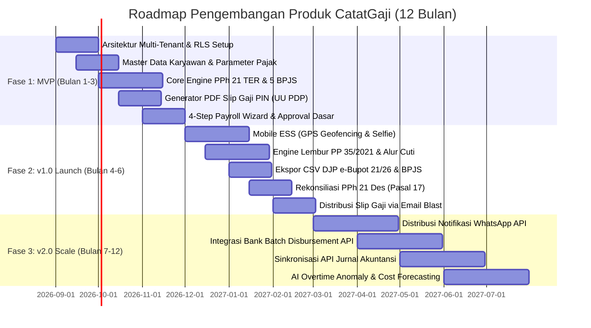

# DOKUMEN PERSYARATAN PRODUK (PRD) — CATATGAJI
## 11. ROADMAP PENGEMBANGAN PRODUK (3 FASE DELIVERABLES)

---

### 1. Visualisasi Timeline Roadmap 3 Fase

Roadmap pengembangan CatatGaji dirancang dalam 3 fase terstruktur yang memastikan stabilitas fondasi kepatuhan hukum, adopsi pengguna yang mulus, serta skalabilitas ekosistem bisnis jangka panjang.

---

### 2. Rincian Deliverables per Fase Pengembangan

---

#### FASE 1: MVP (BULAN 1–3) — CORE HRIS & ENGINE PENGGAJIAN DASAR

**Tujuan Strategis**: Membangun fondasi arsitektur multi-tenant yang aman dan menghadirkan mesin perhitungan gaji, BPJS, dan PPh 21 TER bulanan yang 100% akurat untuk validasi pasar awal (*Alpha/Beta Testing* pada 20 bisnis UMKM).

- **Deliverables & Fitur Utama**:
  1. **Fondasi Multi-Tenant & RBAC**:
     - Implementasi PostgreSQL 16+ Row-Level Security (RLS) dan session context injection.
     - Pendaftaran organisasi (*Tenant Self-Registration*) dan manajemen peran dasar (`COMPANY_OWNER`, `HR_ADMIN`, `EMPLOYEE`).
  2. **Master Data Karyawan & HRIS Dasar**:
     - Form pendaftaran karyawan dengan validasi NIK 16 digit, NPWP 16/15 digit, BPJS TK & Kes, dan nomor rekening bank.
     - Pemetaan otomatis status PTKP (TK/0 s.d. K/3) ke Kategori TER A, B, atau C.
     - Pengelolaan komponen gaji pokok, tunjangan tetap, dan tunjangan tidak tetap.
     - Fitur import massal data karyawan via template spreadsheet Excel.
  3. **Core Engine Kalkulasi Penggajian**:
     - Engine PPh 21 TER Bulanan masa Januari s.d. November (PP 58/2023 & PMK 168/2023).
     - Kalkulasi 5 program BPJS (JKK 5 tingkat risiko, JKM, JHT, JP dengan plafon, BPJS Kesehatan plafon Rp 12 juta).
     - Penanganan potongan keterlambatan dan kasbon manual.
  4. **Slip Gaji Digital Berstandar UU PDP**:
     - Generator berkas PDF slip gaji dengan proteksi password PIN (6 digit tanggal lahir).
     - Unduhan langsung slip gaji dari dashboard web admin.
  5. **4-Step Guided Payroll Wizard**:
     - Alur terpandu penggajian bulanan dari verifikasi kehadiran hingga submit persetujuan.

- **Milestone Gate 1 (Kriteria Kelulusan MVP)**:
  - [x] Lolos uji verifikasi 100 studi kasus numerik kalkulasi gaji, PPh 21 TER, dan BPJS dengan selisih Rp 0,-.
  - [x] Zero data leakage pada uji penetrasi isolasi multi-tenant PostgreSQL RLS.
  - [x] 20 tenant beta aktif berhasil memproses penggajian bulanan pertama tanpa kendala teknis kritis.

---

#### FASE 2: v1.0 PRODUCTION LAUNCH (BULAN 4–6) — MOBILE ESS, LEMBUR, CUTI & e-BUPOT

**Tujuan Strategis**: Meluncurkan aplikasi mobile karyawan mandiri (ESS), otomatisasi lembur dan cuti, integrasi pelaporan pajak DJP Online, serta membuka akses publik (*Commercial Launch*).

- **Deliverables & Fitur Utama**:
  1. **Aplikasi Mobile ESS (React Native / Expo)**:
     - Clock-in / Clock-out berbasis GPS Geofencing (radius kantor $\le 50$ meter) dan swafoto (selfie) langsung via kamera.
     - Deteksi pencegahan manipulasi lokasi (*Anti-Fake GPS Mock Location*).
     - Portal mandiri untuk cek riwayat kehadiran dan unduh slip gaji PDF terenkripsi.
  2. **Modul Lembur & Kompensasi Sesuai PP No. 35/2021**:
     - Alur pengajuan dan approval Surat Perintah Kerja Lembur (SPKL) online.
     - Formulasi jam lembur efektif bertingkat ($1,5\times, 2,0\times, 3,0\times, 4,0\times$ dengan pengali dasar $\frac{1}{173} \times \text{Upah}$).
  3. **Manajemen Cuti & Izin Sakit Online**:
     - Pengajuan cuti tahunan, cuti khusus (melahirkan UU KIA 2024, pernikahan, duka), dan izin sakit dengan lampiran foto dokter.
     - Pengurangan kuota cuti otomatis dan pembaruan rekap kehadiran bulanan.
  4. **Kepatuhan Pajak DJP e-Bupot 21/26 & Formulir 1721-A1**:
     - Ekspor CSV format resmi siap impor ke DJP Online e-Bupot 21/26 (Kode Objek Pajak `21-100-01` & `21-100-02`).
     - Rekonsiliasi PPh 21 masa pajak Desember menggunakan tarif progresif Pasal 17 ayat (1) huruf a UU HPP.
     - Pembuatan bukti potong Formulir 1721-A1 tahunan massal dalam arsip ZIP.
  5. **Distribusi Slip Gaji via Email Blast Massal**:
     - Pengiriman otomatis PDF slip gaji terenkripsi ke alamat email seluruh karyawan setelah payroll disetujui.
  6. **Multi-Cabang & Multi-Departemen**:
     - Pengaturan titik koordinat GPS dan alokasi departemen untuk puluhan outlet cabang.

- **Milestone Gate 2 (Kriteria Kelulusan v1.0 Launch)**:
  - [x] Aplikasi mobile Android & iOS (Expo) sukses terpublikasi di Google Play Store & Apple App Store / PWA installable.
  - [x] File CSV e-Bupot 21/26 berhasil diimpor 100% tanpa error format pada akun DJP Online mitra.
  - [x] Waktu respon API transaksional $p95 < 200\text{ ms}$ pada beban 1.000 pengguna aktif harian.

---

#### FASE 3: v2.0 SCALE & INTEGRATION (BULAN 7–12) — WHATSAPP, BANK DISBURSEMENT & AI

**Tujuan Strategis**: Mengembangkan CatatGaji menjadi ekosistem automasi penggajian menyeluruh dengan integrasi perbankan korporasi, perpesanan instan, software akuntansi, dan analitik kecerdasan buatan.

- **Deliverables & Fitur Utama**:
  1. **Distribusi Slip Gaji via WhatsApp Business API**:
     - Pengiriman ringkasan gaji dan tautan unduh aman satu kali pakai (*one-time secure link*) ke nomor WhatsApp karyawan via BSP resmi.
  2. **Integrasi Transfer Gaji Massal (Bank Batch Disbursement API)**:
     - Ekspor format file dan direct API transfer penggajian massal:
       - **BCA Auto-Payroll / KlikBCA Bisnis (Multi-Transfer)**
       - **Mandiri Cash Management (MCM 2.0)**
       - **BRI Cash Management System (CMS)**
       - **BNI Direct / Corporate Internet Banking**
  3. **Integrasi Software Akuntansi via Webhook**:
     - Sinkronisasi otomatis jurnal akuntansi penggajian double-entry ke **Jurnal by Mekari**, **Accurate Online**, dan **Xero**.
  4. **AI-Powered Payroll Anomaly & Budget Forecasting**:
     - Deteksi dini lonjakan biaya lembur tidak wajar antar cabang operasional.
     - Proyeksi kebutuhan kas untuk Tunjangan Hari Raya (THR) dan kompensasi akhir kontrak PKWT.
  5. **Multi-Currency & Expat Tax Management**:
     - Dukungan penggajian ekspatriat dan konversi kurs valuta asing (USD/SGD/EUR) berdasarkan kurs tengah Bank Indonesia / KMK Pajak.

- **Milestone Gate 3 (Kriteria Kelulusan v2.0 Scale)**:
  - [x] Integrasi direct bank disbursement berhasil mentransfer gaji ratusan karyawan secara instan dalam 1 kali otorisasi token bank.
  - [x] Mencapai target 1.000 tenant berbayar aktif (*Paying Tenants*) dengan $NRR > 115\%$.

---

### 3. Matriks Manajemen Risiko & Rencana Mitigasi

| Kategori Risiko | Identifikasi Risiko | Dampak | Probabilitas | Rencana Mitigasi Komprehensif |
|---|---|:---:|:---:|---|
| **Regulasi Perpajakan** | Terjadi perubahan regulasi tarif PPh 21 atau batas plafon upah BPJS oleh pemerintah. | Tinggi | Sedang | *Design Parameterized Engine*: Seluruh tabel tarif TER, plafon JP, dan PTKP disimpan dalam tabel konfigurasi dinamis yang dapat diperbarui instan di cloud tanpa merilis ulang aplikasi (*Zero-code tax rule updates*). |
| **Keamanan Data & Privasi** | Kebocoran data NIK/Gaji karyawan yang berisiko tuntutan pidana UU No. 27/2022 (UU PDP). | Sangat Tinggi | Rendah | Enkripsi ganda AES-256 at-rest, isolasi kueri PostgreSQL RLS, proteksi password PIN per dokumen PDF slip gaji, dan audit penetrasi berkala (*Security Penetration Testing*). |
| **Operasional Absensi** | Manipulasi lokasi GPS (*Mock Location / Fake GPS*) oleh karyawan lapangan. | Sedang | Tinggi | Integrasi modul deteksi *Anti-Mock Location* pada SDK mobile native dan validasi cross-reference stempel waktu server + IP jaringan Wi-Fi kantor cabang. |
| **Integrasi Eksternal** | Penolakan format file CSV impor oleh portal DJP Online atau SIPP BPJS akibat perubahan format internal instansi. | Tinggi | Sedang | Fitur *Pre-Flight CSV Validator* pada aplikasi CatatGaji yang menguji skema format berkas sebelum diunduh pengguna, serta tim khusus pemantau pembaruan teknis DJP (*Tax Regulatory Watchdog*). |
| **Infrastruktur & Beban** | Lonjakan konkurensi clock-in absensi pada pukul 08.00 pagi menyebabkan server lambat. | Sedang | Sedang | Menerapkan arsitektur Redis Fast-Queue Ingestion dan autoscaling pod Kubernetes (HPA) berdasarkan metrik utilisasi CPU/Memory. |

---

### 4. Target Indikator Kinerja Utama (KPI Bisnis & Produk)

| Metrik Kinerja | Target Akhir Fase 1 (Bulan 3) | Target Akhir Fase 2 (Bulan 6) | Target Akhir Fase 3 (Bulan 12) |
|---|:---:|:---:|:---:|
| **Jumlah Tenant Aktif** | 50 Perusahaan (Beta) | 300 Perusahaan | 1.500 Perusahaan |
| **Total Karyawan Terkelola** | 1.000 Karyawan | 7.500 Karyawan | 45.000 Karyawan |
| **Tingkat Akurasi Perhitungan** | 100,00% (Zero Error) | 100,00% (Zero Error) | 100,00% (Zero Error) |
| **Efisiensi Waktu Payroll HR** | Berkurang 70% | Berkurang 85% | Berkurang > 90% (< 30 mnt/bln) |
| **Tingkat Retensi Tenant (Monthly)**| > 95% | > 97% | > 98.5% |
| **Skor Kepuasan Pengguna (CSAT)** | > 85% | > 90% | > 92% |
